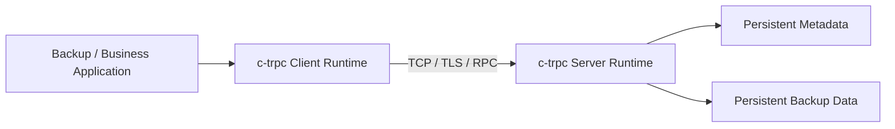
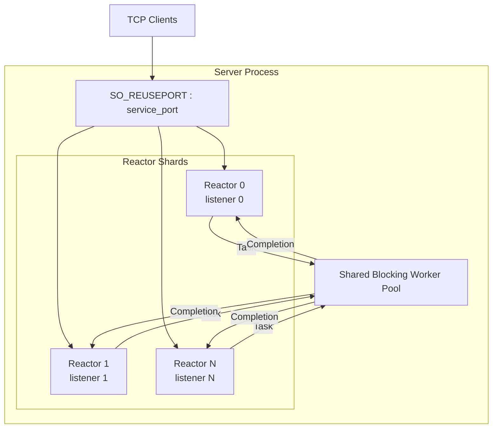
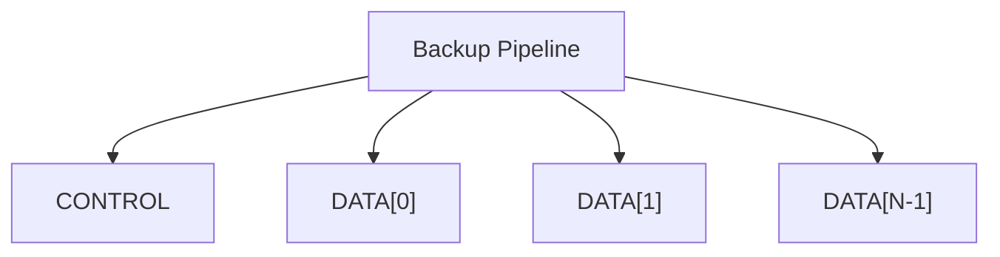

# 架构总览

**状态：CURRENT + TARGET V1**

## 1. System Context



最终产物：

- Server：独立二进制程序，Linux >= 3.10。
- Client：独立二进制 + 可嵌入业务进程的 library。
- Client library 不 fork、不 daemonize、不接管宿主进程全局生命周期。

## 2. CURRENT

当前 `main` 的核心模型：

```text
Server
  ├─ 1 Reactor
  ├─ accept thread
  ├─ reaper thread
  ├─ shared RPC executor
  └─ shared maintenance scheduler

Channel
  ├─ control_connection
  └─ bulk_connection

RPC worker
  └─ 仍会通过 Endpoint/Call 同步进入部分协议状态
```

Reactor connection slot 已采用严格 single-owner 方向；slot generation/state 使用原子 capability metadata，外部控制通过 command 进入 Reactor。

## 3. TARGET V1



每个 Reactor shard 最终拥有自己的：

- listener；
- Connection；
- Channel；
- Stream；
- RPC Endpoint/Call protocol state；
- Backup Pipeline；
- timer；
- shard-local metrics。

Blocking worker 只拥有 task、临时工作状态和 result。

## 4. Backup Pipeline



TARGET V1：

```text
一个 Pipeline
    =
一个 Reactor owner
    =
一个 CONTROL
    +
N 个 DATA connections
```

DATA 并行度由 Client 请求、Server 协商，不写死数量。

## 5. 正确性与性能状态

Server 采用：

```text
soft-stateful
+
durable-stateless
```

允许 worker/Reactor 内存保存：

- inflight chunk；
- ACK batch；
- dedup/hash cache；
- flow-control；
- buffer accounting；
- storage handle；
- Pipeline runtime state。

但以下事实不能只存在 RAM：

- chunk durable completion；
- manifest；
- snapshot/backup commit；
- epoch；
- retention/WORM；
- authoritative resume checkpoint。

## 6. 一句话架构

```text
Protocol state     -> Reactor shard single-owner
Blocking work      -> Worker-owned
Cross-thread       -> message + ownership transfer
Backup correctness -> durable metadata/storage + epoch fencing
Backup performance -> Reactor-local soft state + pipeline
```
