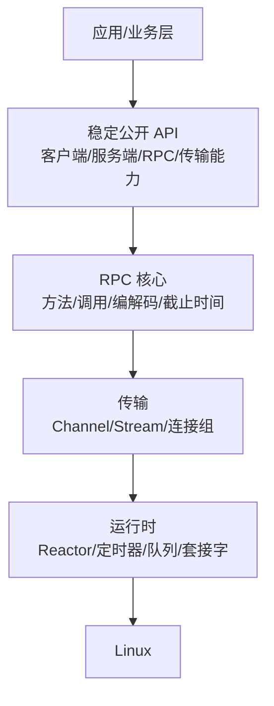

# 架构总览

**状态：当前实现 + V1 目标**

## 1. 系统上下文

c-trpc 是通用 RPC/传输库，不拥有业务语义。


```mermaid
flowchart LR
    APP["应用/业务层"]
    C["c-trpc 客户端"]
    S["c-trpc 服务端"]
    EXT["业务拥有的存储/服务"]

    APP --> C
    C -->|"RPC/传输"| S
    APP --> EXT
    S --> EXT
```

备份、数据库同步、对象复制等都属于应用/业务层。
c-trpc 只负责通信、RPC 生命周期、传输状态与运行时执行。

核心边界：

```text
业务/应用层
    |
    v
公开客户端/服务端/RPC API
    |
    v
RPC
    |
    v
传输/连接组
    |
    v
运行时/Reactor
    |
    v
Linux
```

详细 API/分层约束见
[07-layer-module-api-boundaries.md](07-layer-module-api-boundaries.md)。

## 2. 当前核心模型

当前 `main` 的核心模型：

```text
服务端
  └─ 内部运行时
       ├─ 分片[0..N-1]
       │    ├─ Reactor
       │    ├─ SO_REUSEPORT 监听器
       │    ├─ RPC 执行器
       │    ├─ 对端槽位/计数器
       │    ├─ 消息/重组资源
       │    └─ 对端生命周期 eventfd
       └─ Reactor 本地定时器

客户端
  └─ 内部运行时
       └─ 分片[0]
            └─ Reactor

传输层
  ├─ Channel
  ├─ Stream
  ├─ 共享/拆分物理连接策略
  ├─ 流量控制
  ├─ 保活/重连/排空
  └─ TRP1 分帧

RPC
  └─ 任务 -> 工作线程 -> 完成事件 -> 原 Reactor 所有者

连接组/Pipeline
  └─ 单个 Reactor 所有者
       ├─ CONTROL 成员关系
       ├─ 有界 DATA[N] 成员关系
       ├─ Stream -> DATA 代次亲和关系
       ├─ TRR1 路由标识
       ├─ 分片本地有界注册表
       ├─ DATA 预留/附着能力
       ├─ TRC1 CONTROL 消息
       └─ 分片本地 Pipeline 监听器
```

### 2.1 运行时/分片

服务端门面已支持 `shard_count = N`。

每个分片独立拥有：

- Reactor；
- 监听器；
- 对端表；
- RPC 执行器；
- 运行时队列；
- RX/TX 资源；
- RPC 消息/重组资源；
- 定时器；
- 分片本地指标。

服务端全局配置保持总预算语义，通过确定性的“基础值 + 余数”方式拆分到各分片，不会随 `shard_count` 隐式放大。

`tr_server_listen()` 使用每分片 `SO_REUSEPORT` 监听器。
已经接收的对端留在接受它的分片中，不在热路径跨分片迁移 fd。

### 2.2 所有权

对端表的预留、发布、移除和存活快照都是 Reactor 单所有者操作。

工作线程不直接修改 Connection/Channel/Stream/Endpoint/Call 协议状态：

```text
Reactor 所有者
   -> 任务
工作线程
   -> 完成事件
原 Reactor 所有者
```

旧 Endpoint/Channel 销毁流程先由所有者解除关联，再用强引用作为生命周期隔离，不需要独立回收线程。

### 2.3 连接组/Pipeline

当前内部 Pipeline 已形成通用的多连接传输基础能力：

```text
一个 Pipeline
  -> 一个 Reactor 所有者
  -> 一个 CONTROL
  -> DATA[N]
  -> Stream 亲和关系
```

真实接收的套接字可以按以下流程进入系统：

```text
accept
  -> TRR1 前导信息
      -> CONTROL：授权 -> 会话 -> TRC1 处理器
      -> DATA：代次精确匹配预留后附着 -> 常规 TRP1 解析器
```

CONTROL 连接失效后，先使当前会话失效，再清除 DATA 成员关系与
Stream 亲和关系，随后注销 Pipeline，最后由所有者立即关闭 DATA 套接字。

这些机制属于通用传输能力，不定义备份检查点/提交等业务语义。

## 3. V1 目标分层模型


```mermaid
flowchart TB
    APP["应用/业务层"]
    PUB["稳定公开 API\n客户端/服务端/RPC/传输能力"]
    RPC["RPC 核心\n方法/调用/编解码/截止时间"]
    TR["传输\nChannel/Stream/连接组"]
    RT["运行时\nReactor/定时器/队列/套接字"]
    OS["Linux"]

    APP --> PUB
    PUB --> RPC
    RPC --> TR
    TR --> RT
    RT --> OS
```

目标要求：

- 稳定公开接口不暴露 Reactor；
- 稳定公开接口不暴露槽位/代次；
- 稳定公开接口不要求调用者管理解析器、队列或套接字 fd；
- 内部模块可以直接调用下层；
- 同一所有者执行域不因为“分层”额外增加线程切换、队列或复制。

## 4. API 可见性目标

目标区分：

```text
稳定公开接口
  -> 客户端/服务端/调用/通用传输能力

高级公开接口
  -> 可选的纯传输/零复制/调优能力

内部实现
  -> Reactor/运行时
  -> 解析器/线协议/套接字
  -> 命令/完成/定时器队列
  -> Pipeline 注册表/路由/入口/控制实现
```

当前 SDK 仍存在公开/内部接口混合，详见
[07-layer-module-api-boundaries.md](07-layer-module-api-boundaries.md#10-current-audit)。

## 5. 性能模型

c-trpc 的性能原则：

```text
可变协议状态 -> Reactor 分片单所有者
资源         -> 跟随分片
阻塞工作     -> 工作线程拥有
跨线程协作   -> 消息 + 所有权转移
同所有者分层 -> 允许直接内部调用
数据路径     -> 有界 + 尽量少复制
```

分层不要求每层一个线程或一个队列。

允许：

```text
RPC
  -> 传输层内部调用
  -> Reactor 所有者快速路径
  -> sendmsg()
```

避免：

```text
RPC -> 队列 -> 传输线程 -> 队列 -> 运行时线程
```

除非性能分析明确证明需要这种执行域隔离。

## 6. 核心非目标

c-trpc 核心不负责：

- 备份标识；
- 检查点/清单；
- `STORED` / `CHECKPOINTED` / `COMMITTED`；
- 业务提交/续传；
- 保留策略/WORM；
- 存储/文件系统事务语义。

这些能力可以由业务层建立在 RPC/连接组之上。

## 7. 一句话架构

```text
协议状态 -> Reactor 分片单所有者
模块边界 -> 能力/API + 显式所有权
运行时细节 -> 默认内部化
热路径 -> 直接所有者快速路径 + 有界且尽量少复制的资源
业务状态 -> 位于 c-trpc 核心之外
```
