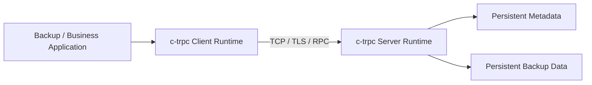
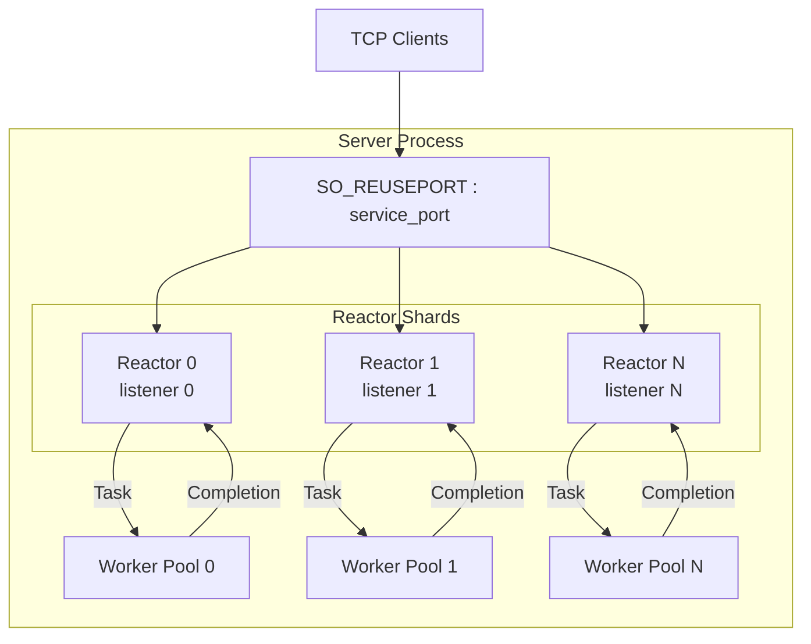
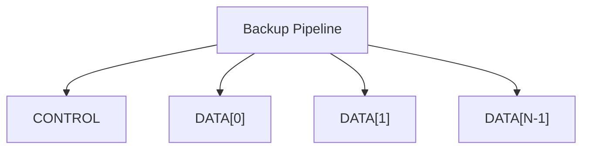

# 架构总览

**状态：CURRENT + TARGET V1**

## 1. System Context


```mermaid
flowchart LR
    APP["Backup / Business Application"]
    CR["c-trpc Client Runtime"]
    SR["c-trpc Server Runtime"]
    META["Persistent Metadata"]
    DATA["Persistent Backup Data"]

    APP --> CR
    CR -->|"TCP / TLS / RPC"| SR
    SR --> META
    SR --> DATA
```

最终产物：

- Server：独立二进制程序，Linux >= 3.10。
- Client：独立二进制 + 可嵌入业务进程的 library。
- Client library 不 fork、不 daemonize、不接管宿主进程全局生命周期。

## 2. CURRENT

当前 `main` 的核心模型：

```text
Server
  ├─ 1 internal Runtime
  │    └─ shard[0]
  │         ├─ 1 Reactor
  │         ├─ listener
  │         ├─ RPC executor
  │         └─ peer slots / peer counters
  ├─ accept thread
  └─ Reactor-local timers

Client
  └─ 1 internal Runtime
       └─ shard[0]
            └─ 1 Reactor

Channel
  ├─ control_connection
  └─ bulk_connection

RPC
  └─ Task -> Worker -> Completion -> original Reactor owner
```

Client/Server 已不再直接拥有 Reactor 生命周期；内部 `tr_runtime` 拥有唯一
`tr_runtime_shard[0]`。Server shard 当前已经拥有 Reactor、listener、RPC executor、peer slots/counters
以及 peer lifecycle eventfd。Listener 已直接注册到 Reactor epoll，accept
readiness 由 Reactor owner 处理，不再存在独立 accept thread。每个 listener
event 最多处理固定批次的新连接，剩余 backlog 由 level-triggered epoll 在后续
turn 继续驱动。

Peer teardown 不再需要 dedicated reaper thread。Channel DOWN、partial peer
rollback 和 peer publish 只 signal shard-local eventfd；该 eventfd 已注册到同一
Reactor epoll，因此 cleanup 在后续 Reactor turn 执行，而不是在当前 Channel
callback 内重入。

```text
Reactor owner detach
  -> remove RPC/Channel callback + timer sources
  -> close RPC executor admission
  -> mark peer slot finalizing
  -> transfer Endpoint owner ref

last Endpoint strong-ref
  -> final Endpoint stats/free
  -> final Channel stats/free
  -> retire peer slot
```

如果仍有 worker task，strong-ref 保证对象存活；最后一个 worker/completion ref
释放时自动 finalization。若没有 worker ref，owner ref transfer 可立即完成
owner-free finalization。

当前仍固定 `shard_count = 1`。

Reactor connection slot 已采用严格 single-owner 方向；slot generation/state 使用原子 capability metadata，外部控制通过 command 进入 Reactor。

## 3. TARGET V1


```mermaid
flowchart TB
    NET["TCP Clients"]

    subgraph SERVER["Server Process"]
        direction TB
        L["SO_REUSEPORT : service_port"]

        subgraph SHARDS["Reactor Shards"]
            direction LR
            R0["Reactor 0\nlistener 0"]
            R1["Reactor 1\nlistener 1"]
            RN["Reactor N\nlistener N"]
        end

        W0["Worker Pool 0"]
        W1["Worker Pool 1"]
        WN["Worker Pool N"]

        L --> R0
        L --> R1
        L --> RN

        R0 -->|"Task"| W0
        R1 -->|"Task"| W1
        RN -->|"Task"| WN

        W0 -->|"Completion"| R0
        W1 -->|"Completion"| R1
        WN -->|"Completion"| RN
    end

    NET --> L
```

每个 Reactor shard 最终拥有自己的：

- listener；
- Connection；
- Channel；
- Stream；
- RPC Endpoint/Call protocol state；
- Backup Pipeline；
- timer；
- shard-local RPC executor / worker queue；
- shard-local metrics。

Blocking worker 只拥有 task、临时工作状态和 result。

## 4. Backup Pipeline


```mermaid
flowchart TB
    P["Backup Pipeline"]
    C["CONTROL"]
    D0["DATA[0]"]
    D1["DATA[1]"]
    DN["DATA[N-1]"]

    P --> C
    P --> D0
    P --> D1
    P --> DN
```

TARGET V1：

```text
一个 Pipeline
    =
一个 Reactor owner
    =
一个 CONTROL
    +
N 个 DATA connections
```

DATA 并行度由 Client 请求、Server 协商，不写死数量。

## 5. 正确性与性能状态

Server 采用：

```text
soft-stateful
+
durable-stateless
```

允许 worker/Reactor 内存保存：

- inflight chunk；
- ACK batch；
- dedup/hash cache；
- flow-control；
- buffer accounting；
- storage handle；
- Pipeline runtime state。

但以下事实不能只存在 RAM：

- chunk durable completion；
- manifest；
- snapshot/backup commit；
- epoch；
- retention/WORM；
- authoritative resume checkpoint。

## 6. 一句话架构

```text
Protocol state     -> Reactor shard single-owner
Blocking work      -> Worker-owned
Cross-thread       -> message + ownership transfer
Backup correctness -> durable metadata/storage + epoch fencing
Backup performance -> Reactor-local soft state + pipeline
```
