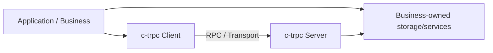
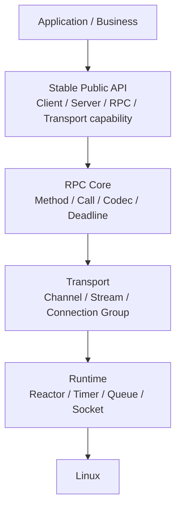

# 架构总览

**状态：CURRENT + TARGET V1**

## 1. System Context

c-trpc 是通用 RPC / Transport library，不拥有业务语义。


```mermaid
flowchart LR
    APP["Application / Business"]
    C["c-trpc Client"]
    S["c-trpc Server"]
    EXT["Business-owned storage/services"]

    APP --> C
    C -->|"RPC / Transport"| S
    APP --> EXT
    S --> EXT
```

Backup、数据库同步、对象复制等都属于 Application / Business。
c-trpc 只负责通信、RPC 生命周期、Transport state 与 Runtime execution。

核心边界：

```text
Business/Application
        |
        v
Public Client/Server/RPC API
        |
        v
RPC
        |
        v
Transport / Connection Group
        |
        v
Runtime / Reactor
        |
        v
Linux
```

详细 API/layer 约束见
[07-layer-module-api-boundaries.md](07-layer-module-api-boundaries.md)。

## 2. CURRENT Core

当前 `main` 的核心模型：

```text
Server
  └─ internal Runtime
       ├─ shard[0..N-1]
       │    ├─ Reactor
       │    ├─ SO_REUSEPORT listener
       │    ├─ RPC executor
       │    ├─ peer slots/counters
       │    ├─ message/reassembly resources
       │    └─ peer lifecycle eventfd
       └─ Reactor-local timers

Client
  └─ internal Runtime
       └─ shard[0]
            └─ Reactor

Transport
  ├─ Channel
  ├─ Stream
  ├─ shared/split physical connection policy
  ├─ flow control
  ├─ keepalive/reconnect/drain
  └─ TRP1 framing

RPC
  └─ Task -> Worker -> Completion -> original Reactor owner

Connection Group / Pipeline
  └─ one Reactor owner
       ├─ CONTROL membership
       ├─ bounded DATA[N] membership
       ├─ Stream -> DATA generation affinity
       ├─ TRR1 route identity
       ├─ shard-local bounded registry
       ├─ DATA reserve/attach capability
       ├─ TRC1 CONTROL messages
       └─ shard-local Pipeline listener
```

### 2.1 Runtime / Shard

Server facade 已支持 `shard_count = N`。

每个 shard 独立拥有：

- Reactor；
- listener；
- peer table；
- RPC executor；
- runtime queues；
- RX/TX resources；
- RPC message/reassembly resources；
- timers；
- shard-local metrics。

Server-wide 配置保持 total-budget 语义，通过 deterministic base+remainder
拆到 shard，不随 shard_count 隐式放大。

`tr_server_listen()` 使用 per-shard `SO_REUSEPORT` listener。
accepted peer 留在接受它的 shard，不在 hot path 跨 shard 迁移 fd。

### 2.2 Ownership

Peer table reserve/publish/remove/live snapshot 是 Reactor single-owner 操作。

Worker 不直接修改 Connection/Channel/Stream/Endpoint/Call protocol state：

```text
Reactor owner
   -> Task
Worker
   -> Completion
original Reactor owner
```

旧 Endpoint/Channel teardown 使用 owner detach + strong-ref lifetime fencing，
不需要 dedicated reaper thread。

### 2.3 Connection Group / Pipeline

当前 internal Pipeline 已是 generic multi-connection Transport foundation：

```text
one Pipeline
  -> one Reactor owner
  -> one CONTROL
  -> DATA[N]
  -> Stream affinity
```

真实 accepted socket 可以：

```text
accept
  -> TRR1 preface
      -> CONTROL: authorize -> session -> TRC1 handler
      -> DATA: exact reservation attach -> normal TRP1 parser
```

CONTROL loss 会先 fence session，再失效 DATA membership/Stream affinity、
注销 Pipeline，最后 owner-immediate 关闭 DATA sockets。

这些机制属于通用 Transport capability，不定义 Backup checkpoint/commit 等业务语义。

## 3. TARGET Layer Model


```mermaid
flowchart TB
    APP["Application / Business"]
    PUB["Stable Public API\nClient / Server / RPC / Transport capability"]
    RPC["RPC Core\nMethod / Call / Codec / Deadline"]
    TR["Transport\nChannel / Stream / Connection Group"]
    RT["Runtime\nReactor / Timer / Queue / Socket"]
    OS["Linux"]

    APP --> PUB
    PUB --> RPC
    RPC --> TR
    TR --> RT
    RT --> OS
```

目标要求：

- Stable Public 不暴露 Reactor；
- Stable Public 不暴露 slot/generation；
- Stable Public 不要求调用者管理 parser/queue/socket fd；
- internal module 可以 direct-call lower layer；
- 同一 owner domain 不因为“分层”额外增加 thread hop/queue/copy。

## 4. API Visibility Target

目标区分：

```text
Stable Public
  -> Client / Server / Call / generic Transport capability

Advanced Public
  -> optional transport-only / zero-copy / tuning capability

Internal
  -> Reactor / Runtime
  -> parser / wire / socket
  -> command/completion/timer queue
  -> Pipeline registry/route/ingress/control implementation
```

当前 SDK 仍存在 public/internal 混合，详见
[07-layer-module-api-boundaries.md](07-layer-module-api-boundaries.md#10-current-audit)。

## 5. Performance Model

c-trpc 的性能原则：

```text
Mutable protocol state -> Reactor shard single-owner
Resources              -> follow shard
Blocking work          -> Worker-owned
Cross-thread           -> message + ownership transfer
Same-owner layering    -> direct internal call is allowed
Data path              -> bounded + copy-minimal
```

分层不要求每层一个线程或 queue。

允许：

```text
RPC
  -> Transport internal call
  -> Reactor owner fast path
  -> sendmsg()
```

避免：

```text
RPC -> queue -> Transport thread -> queue -> Runtime thread
```

除非 profile 明确证明需要这种执行域隔离。

## 6. Core Non-goals

c-trpc core 不负责：

- Backup identity；
- checkpoint / manifest；
- STORED / CHECKPOINTED / COMMITTED；
- business commit/resume；
- retention/WORM；
- storage/filesystem transaction semantics。

这些可以由业务层建立在 RPC / Connection Group 之上。

## 7. 一句话架构

```text
Protocol state  -> Reactor shard single-owner
Module boundary -> capability/API + explicit ownership
Runtime detail  -> internal by default
Hot path        -> direct owner fast path + bounded copy-minimal resources
Business state  -> outside c-trpc core
```
