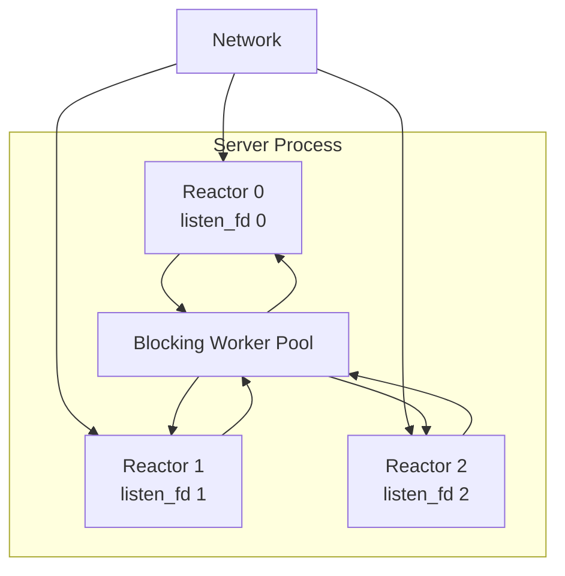

# Runtime 与 Reactor Shard

**状态：CURRENT → TARGET V1**

## 1. Server Runtime

TARGET V1 使用单进程多 Reactor：



### TARGET V1 不再需要

- 中央 accept thread；
- Server reaper thread；
- 每 peer 独立 timer thread。

accept、connection error、peer reclaim 和 timer 应逐步收敛到 Reactor。

## 2. Per-Reactor Listener

Linux >= 3.10 允许将 `SO_REUSEPORT` 作为基础能力。

每个 shard：

```text
socket()
  -> SO_REUSEADDR
  -> SO_REUSEPORT
  -> bind(same address)
  -> listen()
  -> epoll add
```

目标是：

```text
accept creator
    =
initial fd owner
    =
initial protocol owner
```

避免所有连接先经过中央线程再转交。

## 3. Reactor Shard

目标逻辑结构：

```c
struct tr_runtime_shard {
    uint32_t shard_id;

    struct tr_reactor reactor;
    int listen_fd;

    struct tr_command_queue commands;
    struct tr_completion_queue completions;

    struct tr_connection_table connections;
    struct tr_pipeline_table pipelines;

    struct tr_timer_queue timers;
    struct tr_shard_stats stats;
};
```

这只是架构形状，不要求一次性引入所有字段。

## 4. Cross-Shard 操作

禁止非 owner 线程直接修改 shard-local protocol state。

统一模式：

```text
non-owner thread
    |
    | command
    v
owner Reactor
    |
    | mutate local state
    v
done
```

对于 DATA socket affinity，如果 socket 被错误 shard accept：

```text
R7 accept(fd)
  -> 读取固定 routing preface
  -> resolve owner = R3
  -> enqueue ADOPT_ROUTED_FD(fd) to R3
  -> ownership 成功转移
```

同进程内不需要 `SCM_RIGHTS`。

## 5. Client Runtime

Client 默认：

```text
application process
  └─ c-trpc client runtime
       └─ 1 Reactor
```

FUTURE 才允许配置 N Reactor。

Client library 必须保持嵌入友好：

- 不 fork；
- 不 daemonize；
- 不改变宿主进程全局 signal policy；
- 不假设自己拥有整个进程；
- 不默认设置全局 CPU affinity。

## 6. Timer

CURRENT 使用 shared maintenance scheduler。

TARGET：

```text
Reactor shard
  ├─ RPC deadline
  ├─ keepalive
  ├─ Pipeline timeout
  ├─ ACK batch timeout
  └─ checkpoint timer
```

统一进入 Reactor-local timer queue，使用最近 deadline 驱动 `epoll_wait(timeout)`。

这是目标状态；迁移期间 shared maintenance 继续保留。
