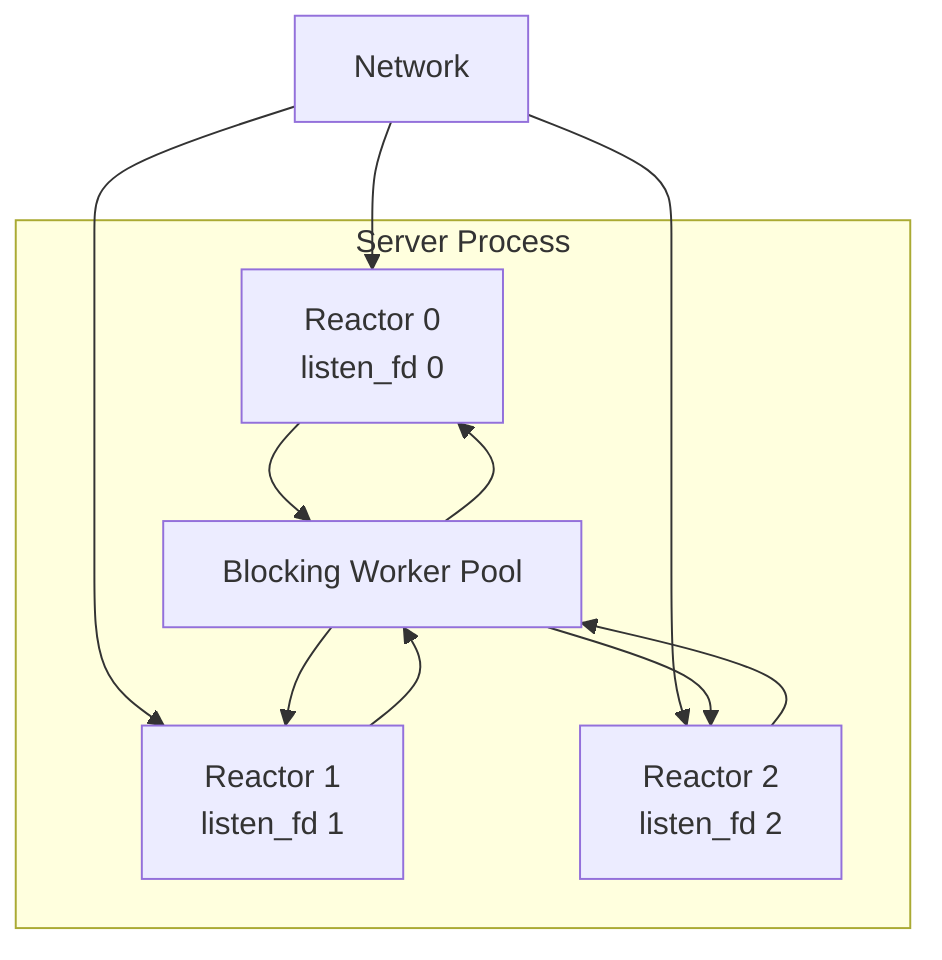

# Runtime 与 Reactor Shard

**状态：CURRENT → TARGET V1**

## 1. Server Runtime

TARGET V1 使用单进程多 Reactor：



### TARGET V1 不再需要

- 中央 accept thread；
- Server reaper thread；
- 每 peer 独立 timer thread。

accept、connection error、peer reclaim 和 timer 应逐步收敛到 Reactor。

## 2. Per-Reactor Listener

Linux >= 3.10 允许将 `SO_REUSEPORT` 作为基础能力。

每个 shard：

```text
socket()
  -> SO_REUSEADDR
  -> SO_REUSEPORT
  -> bind(same address)
  -> listen()
  -> epoll add
```

目标是：

```text
accept creator
    =
initial fd owner
    =
initial protocol owner
```

避免所有连接先经过中央线程再转交。

## 3. Reactor Shard

目标逻辑结构：

```c
struct tr_runtime_shard {
    uint32_t shard_id;

    struct tr_reactor reactor;
    int listen_fd;

    struct tr_command_queue commands;
    struct tr_completion_queue completions;

    struct tr_connection_table connections;
    struct tr_pipeline_table pipelines;

    struct tr_timer_queue timers;
    struct tr_shard_stats stats;
};
```

这只是架构形状，不要求一次性引入所有字段。

## 4. Cross-Shard 操作

禁止非 owner 线程直接修改 shard-local protocol state。

统一模式：

```text
non-owner thread
    |
    | command
    v
owner Reactor
    |
    | mutate local state
    v
done
```

对于 DATA socket affinity，如果 socket 被错误 shard accept：

```text
R7 accept(fd)
  -> 读取固定 routing preface
  -> resolve owner = R3
  -> enqueue ADOPT_ROUTED_FD(fd) to R3
  -> ownership 成功转移
```

同进程内不需要 `SCM_RIGHTS`。

## 5. Client Runtime

Client 默认：

```text
application process
  └─ c-trpc client runtime
       └─ 1 Reactor
```

FUTURE 才允许配置 N Reactor。

Client library 必须保持嵌入友好：

- 不 fork；
- 不 daemonize；
- 不改变宿主进程全局 signal policy；
- 不假设自己拥有整个进程；
- 不默认设置全局 CPU affinity。

## 6. Timer

CURRENT：RPC deadline 与 Channel keepalive 已迁移到 Reactor-local timer，
旧的 shared maintenance scheduler 已删除。reconnect/backoff 仍保留独立
reconnect thread，因为 connect/poll/backoff 不能直接塞进 Reactor timer callback。

Reactor-local timer 基础设施已经落地：

- 每 Reactor 一个 bounded timer queue；
- generation handle 防止 stale timer 操作；
- min-heap 维护最近 absolute `CLOCK_MONOTONIC` deadline；
- 最近 deadline 直接驱动 `epoll_wait(timeout)`；
- 单轮 timer callback 有固定 budget，避免 timer storm 长时间饿死 I/O；
- callback 只允许执行短小、非阻塞的 owner-side 状态推进。

TARGET：

```text
Reactor shard
  ├─ RPC deadline
  ├─ keepalive
  ├─ reconnect/backoff
  ├─ Pipeline timeout
  ├─ ACK batch timeout
  └─ checkpoint timer
```

迁移按 consumer 分步进行。RPC Endpoint 每个只占用一个 Reactor-local timer，
内部扫描 bounded Call table，不按 Call 创建 timer；每个 Channel 也只注册一个
默认 disarm 的 keepalive timer。reconnect 尚未迁移，legacy reconnect thread 暂时
保留；不允许为了迁移一次性同时改动 Multi-Reactor 和 Channel connection-group 语义。

## 7. CURRENT 创建阶段线程预算与回收

以下是库自身的线程增量，不包含应用、测试工具或 sanitizer 的后台线程：

| 操作 | 新增线程 |
|---|---|
| `tr_client_create()` | 1 个 Reactor；尚未创建 RPC worker |
| `tr_server_create()` | 配置的 `executor_threads` 个共享 worker |
| `tr_server_listen()` | 0 |
| `tr_server_start()` | 3 个：Reactor、reaper、accept |

Client connect 才创建 RPC Endpoint worker；启用自动重连时仍可能增加
reconnect thread。deadline / keepalive 不再产生独立线程，也不存在每个
Client/Server 实例额外持有的闲置 maintenance scheduler。

`tests/test_runtime_threads.c` 使用测试目标独有的 pthread create/join 包装，
检查创建前后的精确增量、正常销毁、未 start 的 Server 销毁和部分启动失败回收。
它补充原有连接后线程上限测试，避免把 create 阶段的额外线程计入 baseline
后漏检。故障注入覆盖 Client Reactor、三个共享 worker，以及 Server 的
Reactor/reaper/accept 共七个启动点；每个成功创建的线程必须成功 join，
失败回滚不允许遗留线程或重复 join。
