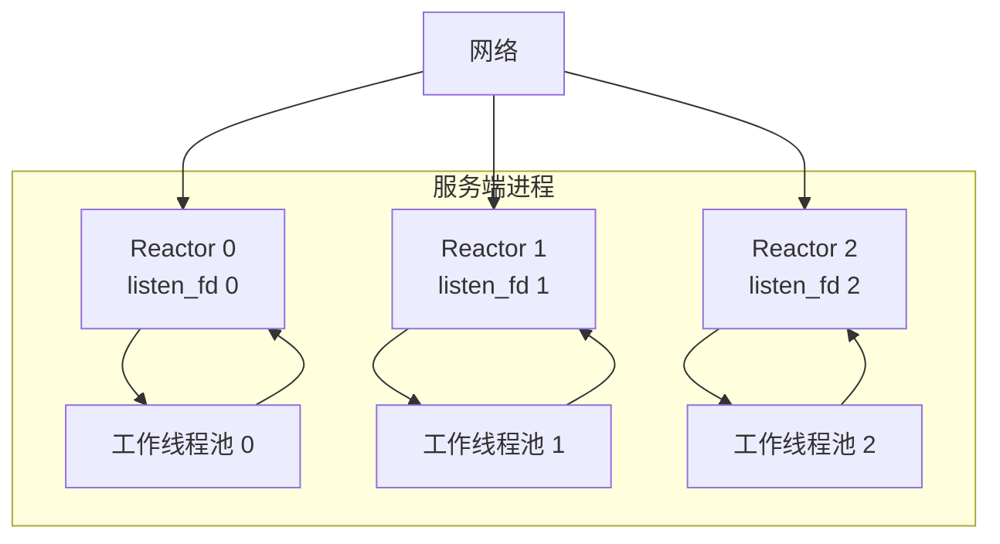

# 运行时与 Reactor 分片

**状态：当前实现 → V1 目标**

## 1. 服务端运行时

当前服务端门面已经进入第 4 阶段的多 Reactor 架构：`tr_server_config.shard_count`
可以创建 N 个独立的服务端/运行时分片，每个分片拥有独立的 Reactor、监听器、
执行器、对端表与热路径缓冲区资源池。

```text
tr_server
  └─ tr_runtime
       └─ 分片[0..N-1]
            ├─ Reactor
            ├─ SO_REUSEPORT 监听器
            ├─ RPC 执行器
            ├─ 对端表/计数器
            └─ Reactor 所有者执行 accept
```

`tr_runtime` 现在负责 Reactor 生命周期；服务端不再直接拥有 Reactor。
服务端监听器已经从 `tr_server` 下沉到 `tr_runtime_shard[0]`，并直接注册到
该分片的 Reactor epoll。监听、关闭和最终清理由分片负责；监听器就绪与 `accept`
由 Reactor 所有者执行，不再创建中央接收线程。

该变化不会增加线程。对端槽位存储、容量/高水位、回收中/就绪/拒绝
计数也已经从 `tr_server` 下沉到 `tr_runtime_shard[0]`。分片额外拥有
对端生命周期 eventfd。Channel DOWN 的 Reactor 回调只负责通知该 eventfd；
eventfd 本身注册在同一个 Reactor epoll 中，因此断开连接的对端清理会在后续
所有者轮次执行，不需要额外线程。

当对端仍位于分片表中时，Reactor 所有者执行解除关联：移除 RPC/Channel 回调、
截止时间/保活定时器源，并关闭服务端 Endpoint 执行器的准入。
随后 Channel 所有权和服务端回收信息转移到预分配的“已解除关联最终清理上下文”，
对端槽位立即清空并允许下一条连接复用。Endpoint 所有者引用再转交给最后引用清理器：
已有工作任务继续持有强引用；最后一个引用释放时自动采集最终 Endpoint/Channel
统计并释放该清理上下文。

槽位生命周期与已退役对象生命周期相互分离，但两者都必须有界：每个分片的
`reaping_current` 最大不超过该分片的对端槽位容量。当退役预算已满时，
新的断连对端暂时保留在对端表中，不执行不可逆的解除关联；任一旧清理器
归还回收槽位后通知分片生命周期 eventfd，Reactor 所有者再重试解除关联。
因此最多存在一份存活/表容量加一份同规模退役容量，不会因为槽位
复用产生无界 Endpoint/Channel 积压。

`reaping_current` 统计的是已经脱离对端表、仍在等待强引用释放的旧对端，
而不是占用中的槽位。服务端销毁只需等待 `reaping_current == 0`，不需要
等待独立回收线程退出。

运行时配置已经改为显式的每分片配置数组：

```c
struct tr_runtime_config {
    uint32_t shard_count;
    const struct tr_runtime_shard_config *shards;
};
```

每个数组项独立描述 Reactor、对端容量、RPC 执行器，以及第 7 阶段
内部的分片内存预算能力。运行时不会把一份资源配置机械复制 N 次；
服务端先把公开的总预算确定性拆分，再将每份配额交给运行时。
客户端门面仍只传入一个分片配置。

第 7 阶段的内存预算目前是**内部记账基础能力**，尚未成为稳定门面的配置项。
RuntimeShard 是预算所有者，跨模块原语位于
`src/memory_budget.h`，避免执行层反向依赖运行时模块。
`limit_bytes == 0` 表示迁移期间只记账、不执行上限；使用方必须先预留，
成功后才能分配，销毁时再精确归还字节数。

当前已接入：

- 运行时对端表；
- Reactor 生命周期固定堆内存：Reactor 对象、槽位/连接表、
  命令/完成环、定时器项/堆、TX/CONTROL-TX 数组、RX 资源池
  描述符/存储；
- 服务端分片 RPC 消息资源池描述符 + 按需保留容量；
- 服务端分片重组固定描述符/存储。

预算统计的是 c-trpc 主动请求的用户态堆内存字节数，不包含分配器元数据、
pthread 实现内部内存，也不包含 fd/epoll 等内核内存。客户端门面的
RPC/重组资源池、RPC Endpoint/Channel 生命周期分配仍待接入，因此目前
仍不对外宣称这是完整的分片内存上限。

V1 目标使用单进程多 Reactor：


```mermaid
flowchart TB
    NET["网络"]
    subgraph PROC["服务端进程"]
        direction LR
        R0["Reactor 0\nlisten_fd 0"]
        R1["Reactor 1\nlisten_fd 1"]
        R2["Reactor 2\nlisten_fd 2"]
        W0["工作线程池 0"]
        W1["工作线程池 1"]
        W2["工作线程池 2"]
    end

    NET --> R0
    NET --> R1
    NET --> R2

    R0 --> W0
    R1 --> W1
    R2 --> W2
    W0 --> R0
    W1 --> R1
    W2 --> R2
```

### V1 目标不再需要

- 每个对端独立的定时器线程。

连接错误、对端回收和定时器应继续收敛到 Reactor；接收连接已经完成迁移。

## 2. 每 Reactor 监听器

Linux >= 3.10 允许将 `SO_REUSEPORT` 作为基础能力。

每个分片：

```text
socket()
  -> SO_REUSEADDR
  -> SO_REUSEPORT
  -> bind(相同地址)
  -> listen()
  -> 加入 epoll
```

目标是：

```text
接收连接的执行者
    =
fd 初始所有者
    =
协议状态初始所有者
```

避免所有连接先经过中央线程再转交。

## 3. Reactor 分片

当前已经落地最小内部形状：

```c
struct tr_runtime {
    uint32_t shard_count;          /* 服务端：N；客户端当前：1 */
    struct tr_runtime_shard *shards;
};

struct tr_runtime_shard {
    uint32_t shard_id;
    struct tr_reactor *reactor;
    struct tr_rpc_executor_group *rpc_executor;
    int listen_fd;
    uint16_t bound_port;

    struct tr_memory_budget memory_budget;

    struct tr_runtime_peer *peers;
    uint64_t peer_storage_bytes;
    uint32_t peer_capacity;
    uint32_t peer_count;
    uint32_t peer_reaping_count;
    int peer_event_fd;
};
```

客户端门面当前仍通过 `shard[0]` 取得 Reactor。服务端为每个运行时分片
创建对应的 `tr_server_shard` 上下文，持有自己的 RPC 消息资源池、
重组资源池、执行器绑定与对端事件注册状态。

服务端的公开数量/容量配置保持总预算语义，份额计算为：

```text
share[i] = total / shard_count + (i < total % shard_count ? 1 : 0)
```

因此开启更多分片不会把工作线程或内存池容量乘以 N。

客户端暂时保留 Endpoint 本地执行器：客户端当前只有单个 Endpoint，且工作线程
生命周期与连接/会话绑定；本阶段不会为了“形式统一”改变其线程生命周期。

监听器、对端、执行器与服务端热缓冲资源所有权已经下沉；接收连接的执行
已经进入 Reactor；对端生命周期事件源与解除关联/最终清理已经完全事件化。
对端的预留/发布/移除/存活快照全部串行化到 Reactor 所有者。
服务端仅保留一个小型 `finalizer_lock`，用于已解除关联清理器的退役
统计合并与关闭条件；它不保护对端表或缓冲资源池。

服务端销毁时，在所有对端/最终清理器静默后先销毁分片缓冲资源池，
让它们把预留归还给 RuntimeShard 预算；最后才销毁运行时。
因此预算所有者严格晚于所有预算使用方销毁。

目标逻辑结构：

```c
struct tr_runtime_shard {
    uint32_t shard_id;

    struct tr_reactor reactor;
    int listen_fd;

    struct tr_command_queue commands;
    struct tr_completion_queue completions;
    struct tr_rpc_executor_group rpc_executor;

    int listen_fd;
    struct tr_runtime_peer *peers;
    struct tr_connection_table connections;
    struct tr_pipeline_table pipelines;

    struct tr_timer_queue timers;
    struct tr_shard_stats stats;
};
```

这只是架构形状，不要求一次性引入所有字段。

## 4. 跨分片操作

禁止非所有者线程直接修改分片本地协议状态。

统一模式：

```text
非所有者线程
    |
    | 命令
    v
所有者 Reactor
    |
    | 修改本地状态
    v
完成
```

对于 DATA 套接字亲和关系，如果套接字被错误分片接收：

```text
R7 accept(fd)
  -> 读取固定路由前导信息
  -> 解析所有者 = R3
  -> 向 R3 提交 ADOPT_ROUTED_FD(fd)
  -> 所有权成功转移
```

同一进程内不需要 `SCM_RIGHTS`。

## 5. 客户端运行时

客户端当前模型：

```text
应用进程
  └─ c-trpc 客户端
       └─ 内部 tr_runtime
            └─ 分片[0]
                 └─ 1 个 Reactor
```

客户端的外部 API 和线程行为未改变；运行时目前是内部所有权层。

未来才允许配置 N 个 Reactor。

客户端库必须保持良好的嵌入性：

- 不 `fork`；
- 不守护进程化；
- 不改变宿主进程全局信号策略；
- 不假设自己拥有整个进程；
- 不默认设置全局 CPU 亲和性。

## 6. 定时器

当前：RPC 截止时间、Channel 保活与客户端自动重连退避
都已经迁移到 Reactor 本地定时器。Channel 重连与 Connection Group DATA
建立共享 Reactor 所有的非阻塞连接器；连接完成通过有界
辅助 fd 事件源回到原所有者，不再创建每 Channel 重连线程。

Reactor 本地定时器基础设施已经落地：

- 每个 Reactor 一个有界定时器队列；
- 代次句柄防止陈旧定时器操作；
- 最小堆维护最近的绝对 `CLOCK_MONOTONIC` 截止时间；
- 最近截止时间直接驱动 `epoll_wait(timeout)`；
- 单轮定时器回调有固定预算，避免定时器风暴长时间饿死 I/O；
- 回调只允许执行短小、非阻塞的所有者侧状态推进。

目标：

```text
Reactor 分片
  ├─ RPC 截止时间
  ├─ 保活
  ├─ 重连/退避
  ├─ Pipeline 超时
  ├─ ACK 批量超时
  └─ 检查点定时器
```

每个 RPC Endpoint 只占用一个 Reactor 本地截止时间定时器，内部扫描有界 Call
表，不按 Call 创建定时器。Channel 保活与重连退避分别使用
Reactor 本地定时器；实际 TCP 连接超时由共享连接器自己的定时器管理。
这些定时器回调只推进短小的所有者侧状态，不执行阻塞的连接或轮询操作。

## 7. 当前创建阶段线程预算与回收

以下是库自身的线程增量，不包含应用、测试工具或 sanitizer 的后台线程：

| 操作 | 新增线程 |
|---|---|
| `tr_client_create()` | 启动运行时 `shard[0]` 的 1 个 Reactor；尚未创建 RPC 工作线程 |
| `tr_server_create()` | 创建 N 分片运行时（Reactor 尚未启动）；内部工作线程总预算拆分到 N 个分片本地工作线程池，精确线程数不属于稳定门面配置 |
| `tr_server_listen()` | 0 |
| `tr_server_start()` | N 个：每个分片启动 1 个 Reactor；连接接收/对端清理都在各自所有者 Reactor 上执行 |

客户端连接时才创建 RPC Endpoint 工作线程。启用自动重连只增加
Reactor 所有的定时器/连接器状态，不新增 pthread。截止时间、保活和
重连都不再产生独立维护线程。

`tests/test_runtime_threads.c` 使用测试目标独有的 pthread create/join 包装，
检查创建前后的精确增量、正常销毁、未启动服务端的销毁和部分启动失败回收。
它补充原有连接后线程上限测试，避免把创建阶段的额外线程计入基线后漏检。
故障注入覆盖客户端 Reactor、三个分片本地工作线程，以及服务端启动阶段
只剩 Reactor 一个 pthread 启动点；每个成功创建的线程必须成功 join，
失败回滚不允许遗留线程或重复 join。
