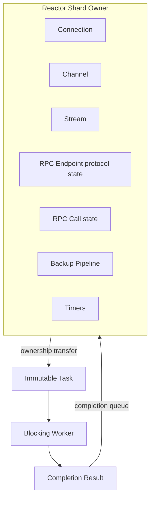

# Ownership 与同步模型

**状态：CURRENT 原则 + TARGET V1 收敛**

## 1. Ownership Map



## 2. 核心不变量

| ID | 不变量 |
|---|---|
| I1 | Mutable protocol object 在任意时刻只有一个 Reactor owner。 |
| I2 | Worker 不直接修改 Connection/Channel/Stream/Endpoint/Call/Pipeline。 |
| I3 | 成功提交到 queue 后才发生 ownership transfer。 |
| I4 | 失败的 enqueue 不转移 ownership，调用方仍负责释放资源。 |
| I5 | Generation/epoch 不匹配的 command/completion 必须安全丢弃。 |
| I6 | TARGET V1 中，一个 Pipeline 只属于一个 Reactor。 |
| I7 | 一个 Stream 生命周期内只绑定一个 DATA connection。 |
| I8 | DATA striping 只发生在 message/chunk boundary。 |
| I9 | durable ACK 只能在约定 durability point 之后产生。 |
| I10 | 所有 durable backup mutation 都受 epoch fencing 保护。 |
| I11 | soft state 可以丢失而不破坏业务正确性。 |
| I12 | CONTROL 可以优先于 DATA，但只能在 frame boundary 调度。 |

## 3. Ownership & Synchronization Matrix

| Object | Owner | 非 owner 如何访问 | 目标同步方式 |
|---|---|---|---|
| Connection | Reactor shard | command | hot state 无锁 |
| Channel | Reactor shard | command | TARGET 去除业务 mutex |
| Stream | Reactor shard | command | hot state 无锁 |
| RPC Endpoint protocol state | Reactor shard | command/completion | TARGET 去除 worker 直接修改 |
| RPC Call | Reactor shard | completion | hot state 无锁 |
| Backup Pipeline | Reactor shard | command | hot state 无锁 |
| Task | Worker | ownership transfer | 无共享修改 |
| Completion | producer → Reactor | bounded per-Reactor MPSC queue | queue synchronization + wake coalescing |
| Worker Queue | executor | submit/pop | mutex + cond 可接受 |
| Generic Buffer Pool | shared | acquire/release | mutex 可接受 |
| Shard-local buffer cache | Reactor shard | return via owner | TARGET 无锁 |
| Runtime lifecycle | runtime owner | lifecycle API | 显式同步 |

## 4. Mutex 删除原则

不采用：

```text
看到 mutex
  -> 改 atomic
```

采用：

```text
确认谁拥有状态
  -> 缩小共享范围
  -> 非 owner 改用 message passing
  -> mutex 无意义后再删除
```

因此：

- command queue、worker queue、shared allocator 的锁可以长期保留；
- `channel->lock`、`endpoint->lock` 的目标是随着 ownership 收敛逐步缩小；
- 不用大量 atomic 重新制造“隐式 shared state”。

## 5. Resource Transfer

继续遵循项目已有资源规则：

```text
1. 谁创建？
2. 当前谁拥有？
3. 所有权何时转移？
4. 最终谁释放？
```

推荐 API 语义：

```text
TR_OK
    -> queue 已取得资源所有权

error
    -> 调用方仍拥有资源
```

这条规则同时适用于：

- Reactor command；
- cross-shard fd handoff；
- RPC task；
- RPC completion（当前使用独立 bounded queue，不再复用 Command Queue）；
- Pipeline work item。
