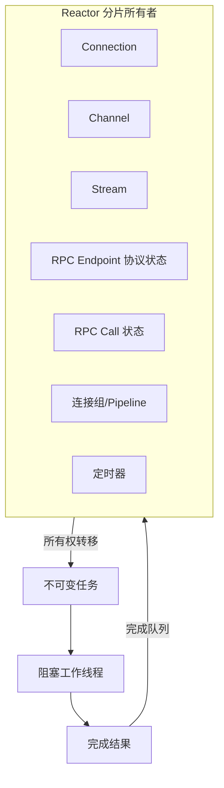

# 所有权与同步模型

**状态：当前原则 + V1 目标收敛**

## 1. 所有权关系图


```mermaid
flowchart TB
    subgraph R["Reactor 分片所有者"]
        C["Connection"]
        CH["Channel"]
        S["Stream"]
        EP["RPC Endpoint 协议状态"]
        CALL["RPC Call 状态"]
        P["连接组/Pipeline"]
        T["定时器"]
    end

    TASK["不可变任务"]
    W["阻塞工作线程"]
    RES["完成结果"]

    R -->|"所有权转移"| TASK
    TASK --> W
    W --> RES
    RES -->|"完成队列"| R
```

## 2. 核心不变量

| 编号 | 不变量 |
|---|---|
| I1 | 可变协议对象在任意时刻只有一个 Reactor 所有者。 |
| I2 | 工作线程不直接修改 Connection/Channel/Stream/Endpoint/Call/Pipeline。 |
| I3 | 成功提交到队列后才发生所有权转移。 |
| I4 | 入队失败不转移所有权，调用方仍负责释放资源。 |
| I5 | 代次/`epoch` 不匹配的命令或完成事件必须安全丢弃。 |
| I6 | 一个连接组/Pipeline 只属于一个 Reactor 所有者。 |
| I7 | 一个 Stream 生命周期内只绑定一个 DATA 连接代次。 |
| I8 | DATA 条带化只发生在逻辑消息/传输边界，不能跨物理连接破坏单个 Stream 的顺序。 |
| I9 | CONTROL 可以优先于 DATA，但只能在帧边界调度。 |
| I10 | 可独立归属的运行时资源跟随分片，不建立跨分片热路径共享池。 |
| I11 | 工作线程完成任务后通过完成事件返回所有者，不直接修改 Reactor 所有的状态。 |
| I12 | 上层只能通过能力/API 使用下层，不直接修改下层内部状态。 |
| I13 | 公开契约不暴露 Reactor 槽位/代次、队列/资源池或解析器内部实现。 |

## 3. 所有权与同步矩阵

| 对象 | 所有者 | 非所有者如何访问 | 目标同步方式 |
|---|---|---|---|
| 监听 fd | Reactor 分片 | Reactor epoll 事件 | 分片拥有监听/关闭；Reactor 所有者处理接收就绪 |
| 对端槽位存储/计数器 | Reactor 分片 | Reactor 接收连接 + 生命周期事件 | 所有者解除关联后清空槽位并立即允许复用 |
| 对端生命周期 eventfd | Reactor 分片 | Channel DOWN / 回滚 / 发布通知 | 同 Reactor 延迟生命周期事件 |
| Connection | Reactor 分片 | 命令 | 热状态无锁 |
| Channel | Reactor 分片 | 命令 | 目标是去除业务互斥锁 |
| Stream | Reactor 分片 | 命令 | 热状态无锁 |
| RPC Endpoint 协议状态 | Reactor 分片 | 命令/完成事件 | 目标是去除工作线程直接修改 |
| RPC Method 注册表 | Reactor 分片 | 同步所有者命令 | 描述符复制后一次性发布；应用线程不直接写 |
| RPC Endpoint 生命周期状态 | 强引用所有者/最终清理器 | 引用计数 + `ref_lock/ref_cond` | 与协议锁分离 |
| RPC Call | Reactor 分片 | 完成事件 | 热状态无锁 |
| 连接组/Pipeline | Reactor 分片 | 命令/所有者 API | 热状态仅所有者访问 |
| 出站连接器 | Reactor 分片 | 所有者 API | 连接中的 fd 由连接器独占；完成/取消时明确转移或关闭 |
| 任务 | 工作线程 | 所有权转移 | 不共享修改 |
| 完成事件 | 生产者 → Reactor | 每 Reactor 有界多生产者单消费者队列 | 队列本地准入 + 唤醒合并；不经过 `ctl_lock` |
| RPC 执行器/工作队列 | Reactor 分片 | 所有者提交/本地工作线程弹出 | 分片本地互斥锁 + 条件变量可以接受 |
| 通用缓冲资源池 | 共享 | 获取/释放 | 互斥锁可以接受 |
| 分片本地缓冲缓存 | Reactor 分片 | 经所有者归还 | 目标无锁 |
| 运行时生命周期 | 运行时所有者 | 生命周期 API | 显式同步 |

## 4. 互斥锁删除原则

不采用：

```text
看到互斥锁
  -> 改成原子变量
```

采用：

```text
确认谁拥有状态
  -> 缩小共享范围
  -> 非所有者改用消息传递
  -> 互斥锁失去意义后再删除
```

因此：

- 分片内命令队列、完成队列、工作队列、共享分配器的局部锁可以长期保留；
- 不允许为了资源复用重新引入跨分片热路径执行器锁；
- `channel->lock`、`endpoint->lock` 的目标是随着所有权收敛逐步缩小；
- Endpoint 强引用等待/已解除关联最终清理已经拆成独立 `ref_lock`，不再复用协议锁；
- 不使用大量原子变量重新制造“隐式共享状态”。

## 5. 分片资源规则

运行时采用：

```text
可变状态跟随所有者。
资源跟随分片。
跨线程完成事件返回所有者。
```

因此服务端 RPC 执行器、工作队列、监听器、对端槽位存储/计数器
已经成为分片本地资源。对端回收唤醒也已由固定轮询改为分片本地 eventfd
通知，Reactor 回调不再为了唤醒回收流程获取服务端全局锁。对端的
Channel/RPC 回调/定时器解除关联已回到 Reactor 所有者；上层 Channel 处理器
发布也已经所有者化。客户端销毁会先解除关联并销毁 RPC + Channel，再停止
运行时 Reactor，因此正常销毁不再需要“Reactor 已停止时的回调兜底路径”。
独立回收线程已经删除。

已解除关联 Endpoint 的所有者引用交给最后引用清理器，已有工作线程引用自然提供
生命周期隔离。对端的预留/发布/移除/存活快照现在全部由 Reactor
所有者串行执行，不再存在服务端全局对端状态转换锁。

仍保留的 `finalizer_lock` 只保护跨线程退役统计聚合和关闭条件，不参与对端热状态。
后续连接表/缓冲预算继续按同一规则迁移。
只有确实无法独立的资源才允许跨分片共享，并且必须单独说明同步与容量边界。

### 对端销毁转移规则

对端从分片转移给最终清理器前必须满足：

```text
不存在 Reactor 连接回调源
不存在 Channel/RPC 上层回调源
不存在已注册的 Endpoint 截止时间定时器
不存在已注册的 Channel 保活定时器
不再接受新的 RPC 执行器任务
```

只有这些所有者可见事件源都解除关联后，Channel 所有权才能转移到
已解除关联最终清理上下文，随后对端槽位立即清空复用。旧 Endpoint 的强引用
负责真正的生命周期隔离；最后一个引用触发最终清理器时，只允许读取最终统计和
释放已解除关联的 Endpoint/Channel，不允许重新进入 Reactor 协议状态修改路径。

## 6. 资源转移

继续遵循项目已有资源规则：

```text
1. 谁创建？
2. 当前谁拥有？
3. 所有权何时转移？
4. 最终谁释放？
```

推荐 API 语义：

```text
TR_OK
    -> 队列已取得资源所有权

错误
    -> 调用方仍拥有资源
```

这条规则同时适用于：

- Reactor 命令；
- 跨分片 fd 移交；
- RPC 任务；
- RPC 完成事件（当前使用独立有界队列，不再复用命令队列）；
- 连接组/Pipeline 工作项；
- Reactor 所有的连接器尝试：`TR_OK` 表示连接器已经接管该尝试；连接
  成功后 fd 所有权通过完成事件转移给 Channel/Group，失败或取消时由
  连接器关闭。
