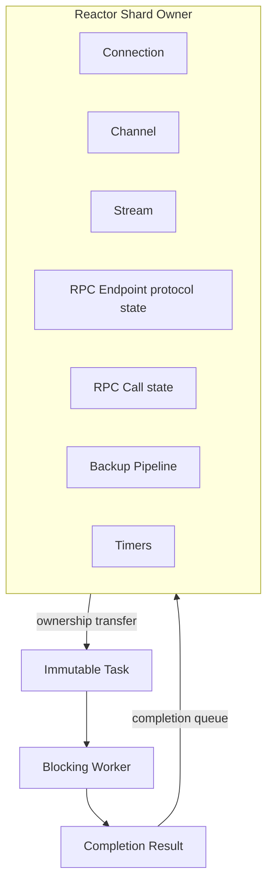

# Ownership 与同步模型

**状态：CURRENT 原则 + TARGET V1 收敛**

## 1. Ownership Map


```mermaid
flowchart TB
    subgraph R["Reactor Shard Owner"]
        C["Connection"]
        CH["Channel"]
        S["Stream"]
        EP["RPC Endpoint protocol state"]
        CALL["RPC Call state"]
        P["Backup Pipeline"]
        T["Timers"]
    end

    TASK["Immutable Task"]
    W["Blocking Worker"]
    RES["Completion Result"]

    R -->|"ownership transfer"| TASK
    TASK --> W
    W --> RES
    RES -->|"completion queue"| R
```

## 2. 核心不变量

| ID | 不变量 |
|---|---|
| I1 | Mutable protocol object 在任意时刻只有一个 Reactor owner。 |
| I2 | Worker 不直接修改 Connection/Channel/Stream/Endpoint/Call/Pipeline。 |
| I3 | 成功提交到 queue 后才发生 ownership transfer。 |
| I4 | 失败的 enqueue 不转移 ownership，调用方仍负责释放资源。 |
| I5 | Generation/epoch 不匹配的 command/completion 必须安全丢弃。 |
| I6 | TARGET V1 中，一个 Pipeline 只属于一个 Reactor。 |
| I7 | 一个 Stream 生命周期内只绑定一个 DATA connection。 |
| I8 | DATA striping 只发生在 message/chunk boundary。 |
| I9 | durable ACK 只能在约定 durability point 之后产生。 |
| I10 | 所有 durable backup mutation 都受 epoch fencing 保护。 |
| I11 | soft state 可以丢失而不破坏业务正确性。 |
| I12 | CONTROL 可以优先于 DATA，但只能在 frame boundary 调度。 |
| I13 | 可独立归属的运行时资源跟随 shard，不建立跨 shard hot-path 共享池。 |
| I14 | Worker 完成工作后通过 completion/event 返回 owner，不直接修改 Reactor-owned 状态。 |

## 3. Ownership & Synchronization Matrix

| Object | Owner | 非 owner 如何访问 | 目标同步方式 |
|---|---|---|---|
| Listener fd | Reactor shard | Reactor epoll event | shard owns listen/close; Reactor owns accept readiness |
| Peer slot storage / counters | Reactor shard | Reactor accept + lifecycle event | slot clears after owner detach and is immediately reusable |
| Peer lifecycle eventfd | Reactor shard | Channel DOWN / rollback / publish signal | same-Reactor deferred lifecycle event |
| Connection | Reactor shard | command | hot state 无锁 |
| Channel | Reactor shard | command | TARGET 去除业务 mutex |
| Stream | Reactor shard | command | hot state 无锁 |
| RPC Endpoint protocol state | Reactor shard | command/completion | TARGET 去除 worker 直接修改 |
| RPC Call | Reactor shard | completion | hot state 无锁 |
| Backup Pipeline | Reactor shard | command | hot state 无锁 |
| Task | Worker | ownership transfer | 无共享修改 |
| Completion | producer → Reactor | bounded per-Reactor MPSC queue | queue-local admission + wake coalescing；不经过 ctl_lock |
| RPC Executor / Worker Queue | Reactor shard | owner submit / local worker pop | shard-local mutex + cond 可接受 |
| Generic Buffer Pool | shared | acquire/release | mutex 可接受 |
| Shard-local buffer cache | Reactor shard | return via owner | TARGET 无锁 |
| Runtime lifecycle | runtime owner | lifecycle API | 显式同步 |

## 4. Mutex 删除原则

不采用：

```text
看到 mutex
  -> 改 atomic
```

采用：

```text
确认谁拥有状态
  -> 缩小共享范围
  -> 非 owner 改用 message passing
  -> mutex 无意义后再删除
```

因此：

- shard 内 command queue、completion queue、worker queue、shared allocator 的局部锁可以长期保留；
- 不允许为了资源复用重新引入跨 shard hot-path executor lock；
- `channel->lock`、`endpoint->lock` 的目标是随着 ownership 收敛逐步缩小；
- 不用大量 atomic 重新制造“隐式 shared state”。

## 5. Shard Resource Rule

运行时采用：

```text
Mutable state follows owner.
Resources follow shard.
Cross-thread completion returns as an event to owner.
```

因此 Server RPC executor、worker queue、listener、peer slot storage/counters
已经成为 shard-local。Peer reaper wake 也已由固定轮询改为 shard-local eventfd
通知，Reactor callback 不再为了唤醒 reaper 获取 Server-global lock。Peer 的
Channel/RPC callback/timer detach 已回到 Reactor owner；dedicated reaper 已删除。
Detached Endpoint 的 owner ref 交给 last-ref finalizer，已有 worker ref 自然提供
lifetime fencing。Peer publish/snapshot 的 `server->lock` 同步仍是过渡状态；
后续 connection table / buffer budget 继续按同一规则迁移。
只有确实无法独立的资源才允许跨 shard 共享，并且必须单独说明同步与容量边界。

### Peer teardown transfer rule

Peer 从 shard 转移给 finalizer 前必须满足：

```text
no Reactor connection callback source
no Channel/RPC upper callback source
no registered Endpoint deadline timer
no registered Channel keepalive timer
no new RPC executor admission
```

只有这些 owner-visible source 都 detach 后，Channel ownership 才能转移到
detached-finalizer context，随后 peer slot 立即清空复用。旧 Endpoint 的 strong-ref
负责真正的 lifetime fencing；最后一个 ref 触发 finalizer，只允许读取最终统计和
释放 detached Endpoint/Channel，不允许重新进入 Reactor protocol mutation。

## 6. Resource Transfer

继续遵循项目已有资源规则：

```text
1. 谁创建？
2. 当前谁拥有？
3. 所有权何时转移？
4. 最终谁释放？
```

推荐 API 语义：

```text
TR_OK
    -> queue 已取得资源所有权

error
    -> 调用方仍拥有资源
```

这条规则同时适用于：

- Reactor command；
- cross-shard fd handoff；
- RPC task；
- RPC completion（当前使用独立 bounded queue，不再复用 Command Queue）；
- Pipeline work item。
