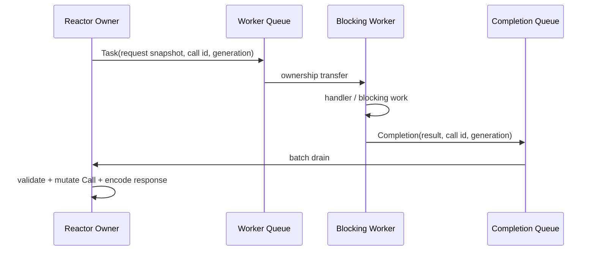

# RPC 执行模型

**状态：TARGET V1，下一阶段优先实现**

## 1. 目标

RPC worker 可以执行阻塞业务，但不能成为 RPC protocol state 的共同 owner。



## 2. Task

Task 应只携带 worker 真正需要的 snapshot/capability：

```c
struct tr_rpc_task {
    uint32_t owner_shard;

    uint32_t endpoint_slot;
    uint32_t endpoint_generation;

    uint32_t call_slot;
    uint32_t call_generation;

    tr_rpc_handler handler;
    void *handler_arg;

    struct tr_buffer *request;
    struct tr_cancel_token *cancel;
};
```

worker 不应该依赖 mutable：

```text
struct tr_rpc_endpoint *
struct tr_rpc_call *
struct tr_channel *
```

如果 handler 需要 metadata，应在 dispatch 时构造只读 snapshot 或独立 owned object。

## 3. Completion

```c
struct tr_rpc_completion {
    uint32_t owner_shard;

    uint32_t endpoint_slot;
    uint32_t endpoint_generation;

    uint32_t call_slot;
    uint32_t call_generation;

    int status;
    struct tr_buffer *response;
};
```

Reactor apply 顺序：

```text
lookup Endpoint
  -> generation valid?
lookup Call
  -> generation valid?
Pipeline / epoch valid? (if applicable)
  -> apply result
  -> update protocol state
  -> enqueue TX
```

任意一步 stale：

```text
drop completion
release owned resources
```

## 4. Completion Queue

每个 Reactor 一个 bounded MPSC completion queue：

```text
worker 0 ─┐
worker 1 ─┼─> completion[R2] -> Reactor 2
worker N ─┘
```

第一版允许 mutex-protected queue，不为“无锁”牺牲正确性。

必须支持 wake coalescing：

```text
queue empty -> non-empty
    -> eventfd wake

already non-empty
    -> only enqueue
```

Reactor 每次 batch drain，而不是每个 completion 一次 wakeup。

## 5. Cancellation

Cancellation 是少数真正适合跨线程 atomic 的状态：

```c
struct tr_cancel_token {
    _Atomic int cancelled;
    _Atomic int status;
};
```

Reactor owner 写：

- remote CANCEL；
- deadline；
- shutdown。

Worker 只查询。

Cancellation token 不是 Call 本身；它不能授权 worker 修改 Call protocol state。

## 6. Unary First

迁移顺序：

```text
Unary
  -> Task
  -> Worker
  -> Completion
  -> Reactor response
```

Unary 完成后再处理 Streaming。

## 7. Streaming

Streaming 对外 API 可以保留，但内部所有会改变协议状态的操作改成 owner command：

```text
worker:
tr_rpc_call_send(payload)
       |
       v
build SEND command
       |
       v
owner Reactor
       |
       v
Call / TX state mutation
```

语义：

```text
TR_OK
    -> Reactor command queue 已取得 payload ownership

error
    -> caller 仍拥有 payload
```

## 8. 不允许的路径

```text
Worker
  -> pthread_mutex_lock(endpoint->lock)
  -> mutate call->state
  -> send response
```

这类路径应逐步消失。

## 9. 验收

至少验证：

- Call 在 worker 运行期间被 cancel；
- Call slot 被释放并复用后旧 completion 到达；
- Endpoint shutdown 与 completion 并发；
- completion queue full；
- worker handler 超时；
- response ownership 在所有失败路径只有一次释放；
- TSan 无新增共享状态 race。
