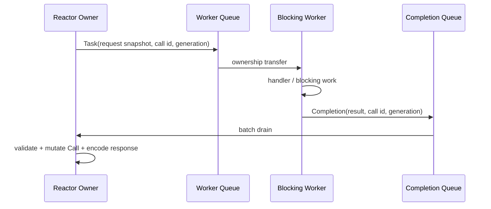

# RPC 执行模型

**状态：TARGET V1，Task snapshot + worker owner-command 已落地**

## 1. 目标

RPC worker 可以执行阻塞业务，但不能成为 RPC protocol state 的共同 owner。


```mermaid
sequenceDiagram
    participant R as Reactor Owner
    participant Q as Worker Queue
    participant W as Blocking Worker
    participant C as Completion Queue

    R->>Q: Task(request snapshot, call id, generation)
    Q->>W: ownership transfer
    W->>W: handler / blocking work
    W->>C: Completion(result, call id, generation)
    C->>R: batch drain
    R->>R: validate + mutate Call + encode response
```

## 2. Task

Task 应只携带 worker 真正需要的 snapshot/capability：

```c
struct tr_rpc_task {
    uint32_t owner_shard;

    uint32_t endpoint_slot;
    uint32_t endpoint_generation;

    uint32_t call_slot;
    uint32_t call_generation;

    tr_rpc_handler handler;
    void *handler_arg;

    struct tr_buffer *request;
    struct tr_cancel_token *cancel;
};
```

worker 不应该依赖 mutable：

```text
struct tr_rpc_endpoint *
struct tr_rpc_call *
struct tr_channel *
```

当前实现已经在 task enqueue 时复制 Stream handle、Method Descriptor、
server handlers、client callbacks 和 handler/callback arg；executor worker
本身不再通过 `endpoint->lock` 回读 live Call。

Task 仍保留 `tr_rpc_call_handle` 作为 callback 身份/capability。业务 callback
主动调用 `tr_rpc_call_send()/send_buffer()/close_send()/finish()/cancel()`，
以及 metadata/cancellation 查询时，会通过同步 Reactor owner-call 执行；
worker 不再直接取得 Endpoint/Call mutable-state lock。

RX payload credit return、retained message release 和 worker 错误 close 也回到
Reactor owner，因此 executor worker 不再直接修改 Stream protocol state。

如果 handler 需要 metadata，应在 dispatch 时构造只读 snapshot 或独立 owned object。

## 3. Completion

```c
struct tr_rpc_completion {
    uint32_t owner_shard;

    uint32_t endpoint_slot;
    uint32_t endpoint_generation;

    uint32_t call_slot;
    uint32_t call_generation;

    int status;
    struct tr_buffer *response;
};
```

Reactor apply 顺序：

```text
lookup Endpoint
  -> generation valid?
lookup Call
  -> generation valid?
Pipeline / epoch valid? (if applicable)
  -> apply result
  -> update protocol state
  -> enqueue TX
```

任意一步 stale：

```text
drop completion
release owned resources
```

## 4. Completion Queue

每个 Reactor 一个 bounded MPSC completion queue：

```text
worker 0 ─┐
worker 1 ─┼─> completion[R2] -> Reactor 2
worker N ─┘
```

第一版允许 mutex-protected queue，不为“无锁”牺牲正确性。

必须支持 wake coalescing：

```text
queue empty -> non-empty
    -> eventfd wake

already non-empty
    -> only enqueue
```

Reactor 每次 batch drain，而不是每个 completion 一次 wakeup。

Completion admission 由 completion queue 自己串行化，不再借用 Reactor
`ctl_lock`。生命周期顺序为：

```text
worker push
   -> completion_queue.lock
   -> admission open?
   -> publish item
   -> optional coalesced eventfd wake

stop
   -> close completion admission under completion_queue.lock
   -> publish STOP command
   -> Reactor shutdown drain all previously accepted completions
```

因此 completion producer 只竞争所属 shard 的 completion queue 短锁，不与
adopt/send/call 等 Reactor 控制面共用生命周期 mutex。当前仍保留 mutex-protected
bounded MPSC queue；是否进一步改为 SPSC/MPSC atomic ring 必须由 profile 决定。

## 5. Cancellation

Cancellation 是少数真正适合跨线程 atomic 的状态：

```c
struct tr_cancel_token {
    _Atomic int cancelled;
    _Atomic int status;
};
```

Reactor owner 写：

- remote CANCEL；
- deadline；
- shutdown。

Worker 只查询。

Cancellation token 不是 Call 本身；它不能授权 worker 修改 Call protocol state。

## 6. Unary First

迁移顺序：

```text
Unary
  -> Task
  -> Worker
  -> Completion
  -> Reactor response
```

Unary 完成后再处理 Streaming。

## 7. Streaming

Streaming 对外 API 可以保留，但内部所有会改变协议状态的操作改成 owner command：

```text
worker:
tr_rpc_call_send(payload)
       |
       v
build SEND command
       |
       v
owner Reactor
       |
       v
Call / TX state mutation
```

语义：

```text
TR_OK
    -> Reactor command queue 已取得 payload ownership

error
    -> caller 仍拥有 payload
```

## 8. 不允许的路径

```text
Worker executor internals
  -> pthread_mutex_lock(endpoint->lock)
  -> read/mutate live Call
```

这条隐式路径已经从 executor task dispatch 中移除。

worker callback 的修改型公开 API 已经通过 owner-call 回到 Reactor：

```text
worker callback
  -> bounded Reactor command
  -> Reactor owner
  -> validate generation
  -> mutate Call / Stream
  -> synchronous status back to worker
```

`endpoint->lock` 当前仍作为 application 控制面尚未完全 owner 化之前的过渡锁。
后续应迁移 Call 创建/注册/flush/stats 等剩余控制面，然后再缩小或删除这把锁。

## 9. 验收

至少验证：

- Call 在 worker 运行期间被 cancel；
- Call slot 被释放并复用后旧 completion 到达；
- Endpoint shutdown 与 completion 并发；
- completion queue full；
- worker handler 超时；
- response ownership 在所有失败路径只有一次释放；
- TSan 无新增共享状态 race。


## 9. Endpoint Teardown: Detach Then Finalize

Server peer teardown 不再由 cleanup thread 同步执行完整 Endpoint destructor。

Phase 1 在 Reactor owner 上执行：

```text
detach Endpoint
  -> Channel upper handler = NULL
  -> unregister deadline timer
  -> executor stopping = true
  -> reject new executor task admission
```

Server 使用 shard-local executor group，因此该阶段不会 join worker。已经 queued /
running 的 task 继续持有 Endpoint strong-ref 并正常完成。

Phase 2 不再由 dedicated cleanup thread 等待。Owner detach 完成后先 arm
last-ref finalizer，再释放 Endpoint 的 owner ref：

```text
drop Endpoint owner ref
  -> existing worker/completion refs keep object alive
  -> last strong-ref release
  -> final executor/stat snapshot
  -> free Endpoint
  -> finalize detached Channel/context
```

因此没有线程会阻塞等待 refcount；finalizer 不调用
`tr_reactor_quiesce()`，也不拥有任何 protocol state mutation 权限。
