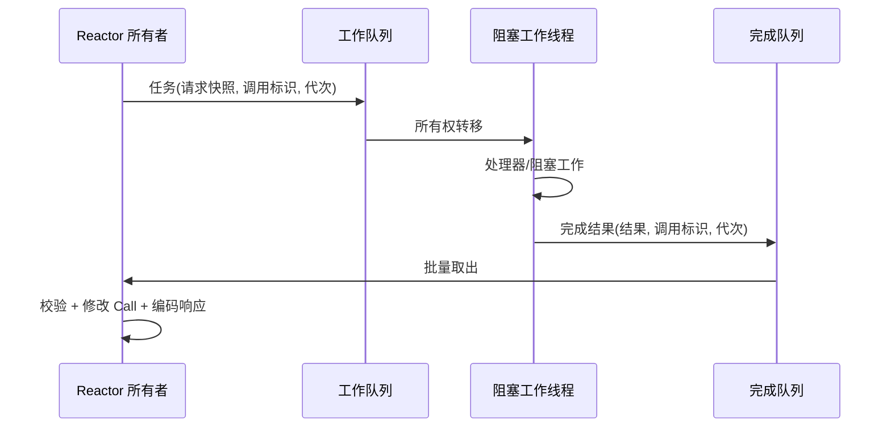

# RPC 执行模型

**状态：V1 目标，任务快照 + 工作线程所有者命令已经落地**

## 1. 目标

RPC 工作线程可以执行阻塞业务，但不能成为 RPC 协议状态的共同所有者。


```mermaid
sequenceDiagram
    participant R as Reactor 所有者
    participant Q as 工作队列
    participant W as 阻塞工作线程
    participant C as 完成队列

    R->>Q: 任务(请求快照, 调用标识, 代次)
    Q->>W: 所有权转移
    W->>W: 处理器/阻塞工作
    W->>C: 完成结果(结果, 调用标识, 代次)
    C->>R: 批量取出
    R->>R: 校验 + 修改 Call + 编码响应
```

## 2. 任务

任务应只携带工作线程真正需要的快照/能力：

```c
struct tr_rpc_task {
    uint32_t owner_shard;

    uint32_t endpoint_slot;
    uint32_t endpoint_generation;

    uint32_t call_slot;
    uint32_t call_generation;

    tr_rpc_handler handler;
    void *handler_arg;

    struct tr_buffer *request;
    struct tr_cancel_token *cancel;
};
```

工作线程不应该依赖以下可变对象：

```text
struct tr_rpc_endpoint *
struct tr_rpc_call *
struct tr_channel *
```

当前实现已经在任务入队时复制 Stream 句柄、Method Descriptor、
服务端处理器、客户端回调以及处理器/回调参数；执行器工作线程
本身不再通过 `endpoint->lock` 回读存活 Call。

任务仍保留 `tr_rpc_call_handle` 作为回调身份/能力句柄。业务回调
主动调用 `tr_rpc_call_send()/send_buffer()/close_send()/finish()/cancel()`，
以及元数据/取消查询时，会通过同步 Reactor 所有者调用执行；
工作线程不再直接取得 Endpoint/Call 可变状态锁。

RX 载荷额度归还、保留消息释放和工作线程错误关闭也回到
Reactor 所有者，因此执行器工作线程不再直接修改 Stream 协议状态。

处理器需要 Call 身份/生命周期时使用 `tr_rpc_call_get_context()` 取得
所有者一致快照；初始/尾部元数据通过独立 API 访问。工作线程不直接
回读存活 Endpoint/Call 指针。

V1 拦截器建立在 Call 句柄 + 上下文快照 + 元数据 API 上，
不会获得 Endpoint/Stream/槽位等引擎内部标识。钩子在 Reactor 所有者上同步执行，
但调用钩子前会释放 `endpoint->lock`，因此上下文/元数据 API 可以安全重入。

钩子必须短小且非阻塞；同一个 Call 在钩子期间执行
`send/close_send/finish/cancel` 时，运行时返回 `TR_ERR_STATE`，
防止拦截器重新成为协议状态所有者。

## 3. 完成事件

```c
struct tr_rpc_completion {
    uint32_t owner_shard;

    uint32_t endpoint_slot;
    uint32_t endpoint_generation;

    uint32_t call_slot;
    uint32_t call_generation;

    int status;
    struct tr_buffer *response;
};
```

Reactor 应用完成结果的顺序：

```text
查找 Endpoint
  -> 代次有效？
查找 Call
  -> 代次有效？
Pipeline / epoch 有效？（如果适用）
  -> 应用结果
  -> 更新协议状态
  -> 加入 TX
```

任意一步发现陈旧对象：

```text
丢弃完成事件
释放其拥有的资源
```

## 4. 完成队列

每个 Reactor 一个有界多生产者单消费者完成队列：

```text
工作线程 0 ─┐
工作线程 1 ─┼─> completion[R2] -> Reactor 2
工作线程 N ─┘
```

第一版允许互斥锁保护的队列，不为“无锁”牺牲正确性。

必须支持唤醒合并：

```text
队列 空 -> 非空
    -> eventfd 唤醒

已经非空
    -> 只入队
```

Reactor 每次批量取出，而不是每个完成事件执行一次唤醒。

完成事件准入由完成队列自己串行化，不再借用 Reactor
`ctl_lock`。生命周期顺序为：

```text
工作线程提交
   -> completion_queue.lock
   -> 准入是否开放？
   -> 发布项目
   -> 可选的合并 eventfd 唤醒

停止
   -> 在 completion_queue.lock 下关闭完成事件准入
   -> 发布 STOP 命令
   -> Reactor 关闭阶段排空此前已经接受的所有完成事件
```

因此完成事件生产者只竞争所属分片的完成队列短锁，不与
接管/发送/调用等 Reactor 控制面共用生命周期互斥锁。

满队列的背压规则：

```text
工作线程提交
   -> 队列已满
   -> 在队列本地 not_full 上休眠
   -> Reactor 批量弹出
   -> 唤醒被阻塞的生产者
   -> 在同一队列锁下重试

停止
   -> 关闭准入 + 推进准入代次
   -> 广播唤醒所有等待者
   -> 即使 Reactor 随后重新开放，旧等待者仍返回 CLOSED
```

这保证三件事：

- 工作线程不使用 `sched_yield()` 消耗 CPU；
- 队列容量仍然是硬上限，不建立旁路队列；
- 停止/重启之间存在准入代次隔离：已经在旧准入代次中
  进入容量等待的生产者即使晚于重新开放才醒来，也只能返回 `CLOSED`。

当前仍保留互斥锁 + 条件变量的有界多生产者单消费者队列；是否进一步改为
原子环形队列/`futex` 必须由性能分析决定，而不是为了“无锁”增加生命周期复杂度。

## 5. 取消

取消状态是少数真正适合跨线程原子变量的状态：

```c
struct tr_cancel_token {
    _Atomic int cancelled;
    _Atomic int status;
};
```

Reactor 所有者写入：

- 远端 `CANCEL`；
- 截止时间；
- 关闭流程。

工作线程只查询。

取消令牌不是 Call 本身；它不能授权工作线程修改 Call 协议状态。

## 6. 一元调用优先

迁移顺序：

```text
一元调用
  -> 任务
  -> 工作线程
  -> 完成事件
  -> Reactor 响应
```

一元调用完成后再处理流式调用。

## 7. 流式调用

流式调用对外 API 可以保留，但内部所有会改变协议状态的操作改成所有者命令：

```text
工作线程：
tr_rpc_call_send(payload)
       |
       v
构造 SEND 命令
       |
       v
所有者 Reactor
       |
       v
Call / TX 状态修改
```

语义：

```text
TR_OK
    -> Reactor 命令队列已经取得 payload 所有权

错误
    -> 调用方仍拥有 payload
```

## 8. 不允许的路径

```text
工作线程执行器内部
  -> pthread_mutex_lock(endpoint->lock)
  -> 读取/修改存活 Call
```

这条隐式路径已经从执行器任务分发中移除。

工作线程回调的修改型公开 API 已经通过所有者调用回到 Reactor：

```text
工作线程回调
  -> 有界 Reactor 命令
  -> Reactor 所有者
  -> 校验代次
  -> 修改 Call / Stream
  -> 将同步状态返回工作线程
```

Method 注册也属于同一控制面模型：

```text
应用注册方法
    -> 校验/复制描述符
    -> 同步 Reactor 所有者调用
    -> 重复/容量检查
    -> 发布 Method 项 + 哈希索引
    -> 返回 TR_OK
```

因此注册成功本身就是顺序屏障：后续所有者事件能够看到完整 Method，
不存在应用线程与入站 `REQUEST` 并发修改 Method 表的窗口。

同步所有者命令在环形队列满载时不会使用 `sched_yield()` 轮询：

```text
工作线程/应用线程
  -> 在 ctl_lock 下校验 Reactor 生命周期
  -> 获取命令等待代次快照
  -> 释放 ctl_lock
  -> 队列满时等待 command_queue.not_full
  -> 所有者批量弹出并唤醒等待者
  -> 命令入队
  -> 等待请求响应
```

停止流程会先关闭普通命令等待者准入；尚未成功入队的同步请求直接返回
`TR_ERR_CLOSED`，而已经入队的请求仍排在 `STOP` 前执行。异步 `SEND/RESUME`
仍保持 `TR_AGAIN`，不会因为本次优化变成隐式阻塞 API。

`endpoint->lock` 当前仍作为协议/兜底快照的过渡锁。Method
注册与客户端 Call 创建/启动已经所有者化；后续重点只剩统计/读取
与关闭兜底等确实跨执行域的路径，不能再把已经仅所有者访问的控制面误写成
未来工作。

## 9. 验收

至少验证：

- Call 在工作线程运行期间被取消；
- Call 槽位释放并复用后旧完成事件到达；
- Endpoint 关闭与完成事件并发；
- 完成队列已满；
- 工作线程处理器超时；
- 响应所有权在所有失败路径只释放一次；
- TSan 无新增共享状态竞争。

## 10. Endpoint 销毁：先解除关联，再最终释放

服务端对端销毁不再由清理线程同步执行完整 Endpoint 析构。

第一阶段在 Reactor 所有者上执行：

```text
解除 Endpoint 关联
  -> Channel 上层处理器 = NULL
  -> 注销截止时间定时器
  -> executor stopping = true
  -> 拒绝新的执行器任务准入
```

服务端使用分片本地执行器组，因此该阶段不会等待工作线程退出。已经排队/
运行中的任务继续持有 Endpoint 强引用并正常完成。

第二阶段不再由独立清理线程等待。所有者解除关联完成后先设置
最后引用清理器，再释放 Endpoint 的所有者引用：

```text
释放 Endpoint 所有者引用
  -> 已有工作线程/完成事件引用继续保持对象存活
  -> 最后一个强引用释放
  -> 采集最终执行器/统计快照
  -> 释放 Endpoint
  -> 完成已解除关联的 Channel/上下文清理
```

因此没有线程会阻塞等待引用计数；最终清理器不调用
`tr_reactor_quiesce()`，也不拥有任何协议状态修改权限。
