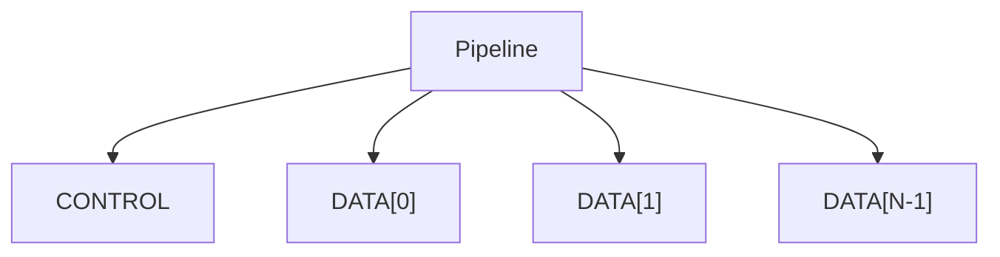
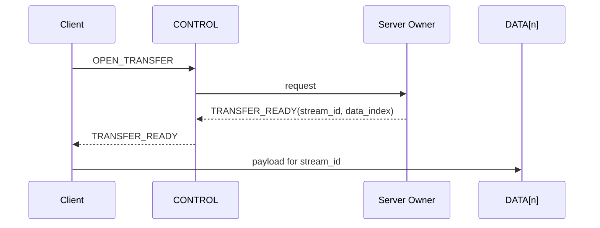

# Backup Pipeline

**状态：TARGET V1；DataShard 为 FUTURE**

## 1. 定义

Backup Job 是持久业务对象；Pipeline 是一次运行期的传输/协议 soft-state domain。

```text
Backup Job
    !=
Pipeline
    !=
TCP Connection
```

TARGET V1：

```text
一个 Pipeline
    =
一个 Reactor owner
    =
一个 CONTROL
    +
N 个 DATA connections
```

## 2. Connection Group



CONTROL 负责：

- OPEN/RESUME；
- transfer 建立；
- CANCEL；
- BARRIER；
- CREDIT；
- ACK batch；
- COMMIT/ABORT；
- keepalive/error。

DATA 只承担大块 payload。

## 3. Identity

需要区分：

```text
backup_id
    durable business identity

pipeline_id
    runtime instance identity

epoch
    durable fencing generation
```

worker/server restart 后 Pipeline 可以重建，但 backup_id 不变。

## 4. Stream 与 DATA Affinity

一个 Stream 生命周期内只绑定一个 DATA connection：

```text
Stream 1001 -> DATA[2]
```

禁止同一个 Stream 的 frame 在 DATA[0]/DATA[1]/DATA[2] 间跳转。

DATA[2] 失败时，旧 Stream 终止，通过新 Stream 重试。

## 5. Striping

允许：

```text
Chunk 0 -> DATA[0]
Chunk 1 -> DATA[1]
Chunk 2 -> DATA[2]
Chunk 3 -> DATA[0]
```

禁止：

```text
Chunk A fragment 0 -> DATA[0]
Chunk A fragment 1 -> DATA[1]
```

因为多个 TCP connection 没有统一字节 ordering。

## 6. Cross-Socket Ordering

CONTROL 与 DATA 之间必须显式建立 barrier：



Client 只有收到 `TRANSFER_READY` 后才能在指定 DATA connection 发送。

## 7. Soft State

Pipeline 内允许保存：

- inflight chunk table；
- recent completion cache；
- ACK batch；
- dedup/hash cache；
- reorder metadata；
- compression/encryption context；
- storage handle；
- buffer accounting；
- flow-control；
- runtime metrics。

这些状态允许整个 Server crash 后丢失。

## 8. Durable Truth

不能只存在 Pipeline RAM：

- chunk durable completion；
- manifest；
- authoritative resume checkpoint；
- backup commit；
- snapshot visibility；
- epoch；
- retention/WORM。

所以服务端模型是：

```text
stateful for performance
stateless for correctness
```

更准确地说：

```text
soft-stateful + durable-stateless
```

## 9. Flow Control

Pipeline 不只依赖 TCP window：

```text
Stream credit
  -> Connection budget
  -> Pipeline inflight budget
  -> Shard memory budget
  -> Worker admission
  -> Storage backend capacity
```

Server advertised credit 应由真实资源能力驱动。

## 10. Elephant Pipeline

V1 保持一个 Pipeline 一个 Reactor，以获得最简单的 ownership。

FUTURE 如果 benchmark 证明：

```text
one Pipeline saturates one Reactor
while other Reactor shards are idle
```

再拆：

```text
Backup Job
    |
Control Owner
    |
    +-- DataShard 0 -> R0
    +-- DataShard 1 -> R3
    +-- DataShard 2 -> R6
```

DataShard 之间仍然不共享 mutable Pipeline object，只交换 message/completion。
