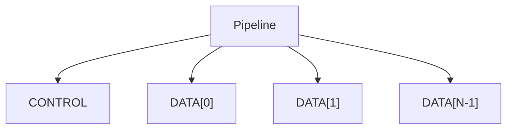
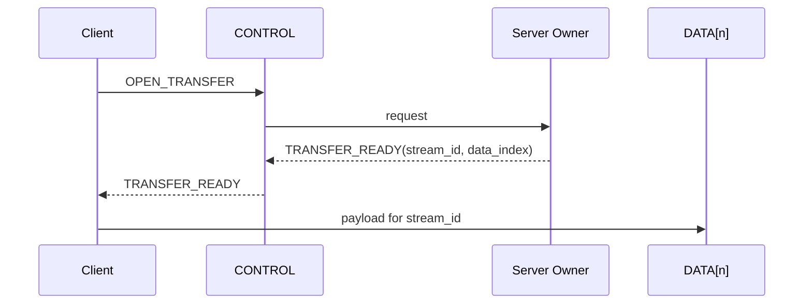

# Backup Pipeline

**状态：CURRENT FOUNDATION → TARGET V1；DataShard 为 FUTURE**

## 0. CURRENT Foundation

Phase 5 第一层已经落地内部 `tr_pipeline` soft-state object，但尚未接入 public
facade 或 wire routing。

当前对象固定：

```text
one Pipeline
  -> one Reactor owner
  -> optional CONTROL membership
  -> bounded DATA[0..N-1] membership
  -> bounded Stream -> DATA affinity table
```

已经编码的 invariants：

- CONTROL/DATA connection 必须属于 Pipeline owner Reactor；
- 同一个物理 connection 只能出现一次，不能同时属于 CONTROL 与 DATA；
- DATA slot 使用独立 generation，slot reuse 不会造成 ABA；
- DATA 选择采用 owner-serialized round-robin，仅用于新 Stream 建立；
- Stream 一旦绑定 DATA，生命周期内不允许重新绑定；
- affinity 保存 `(data_index, data_generation)`；
- DATA removal 会使绑定该 generation 的所有 Stream affinity 立即失效；
- 同 index 后续被新 connection 复用时，旧 Stream 不会“复活”到新 connection；
- membership/affinity 是 bounded preallocated state，没有无界容器。

所有 mutable operation 都通过 Pipeline owner Reactor 串行化。

当前已实现 routing preface / wire identity 的固定格式与 incremental parser，但尚未
接到 Server accept path / Pipeline registry。

当前尚未实现：

- CONTROL 建立 DATA membership 的 reserve/attach 协议消息；
- `TRANSFER_READY` barrier；
- facade/Backup API；
- cross-shard fd transfer；
- durable backup identity / epoch fencing。

因此当前 `tr_pipeline` 是后续协议层的 ownership/membership substrate，不是完整
Backup Pipeline protocol。

## 0.1 Routing Preface

新物理 connection 在进入普通 `TRP1` Transport framing 前，先发送固定 48-byte
Pipeline routing preface：

```text
offset  size  field
0       4     magic = "TRR1"
4       2     route_version
6       2     role = CONTROL | DATA
8       4     flags
12      4     owner_shard_id
16      8     pipeline_id
24      8     epoch
32      4     member_index
36      4     member_generation
40      4     header_crc32c
44      4     reserved
```

全部整数使用 little-endian，与现有 Transport wire encoding 一致；CRC 使用 CRC32C。

语义：

```text
CONTROL:
    member_index = UINT32_MAX
    member_generation != 0

DATA:
    member_index = reserved DATA index
    member_generation = CONTROL-plane issued membership generation
```

`member_generation` 是 Pipeline membership capability generation，不是 Reactor
connection slot generation。协议层禁止暴露 Reactor slot/generation 作为远端
routing identity。

`owner_shard_id` 同样是 CONTROL-plane 发出的 routing target，不是客户端自证。
未来 attach 必须同时验证：

```text
pipeline_id
epoch
owner_shard_id
role
member_index
member_generation
```

和 server-side Pipeline registry / reservation state 完全匹配后才能加入 group。

当前 parser 支持 TCP 任意碎片与 coalescing：

```text
recv:
    [partial preface]
    [remaining preface + TRP1 HELLO bytes]
```

parser 只消费 48-byte preface；同一次 read 中剩余的 Transport bytes 原样留给普通
frame parser。完整 preface 一旦 CRC/语义失败就是 connection-fatal，不尝试从任意
字节重新同步。

当前已经增加 shard-local bounded Pipeline registry 与 DATA reservation/attach
capability，但还没有把 preface parser 接入 listener/accepted-fd path。

### Registry / Reservation

每个 owner shard 可以维护一个 bounded Pipeline registry：

```text
Registry(shard S)
  -> pipeline_id -> Pipeline*
```

Registry mutation/route attach 与 Pipeline mutation一样，通过该 shard Reactor owner
串行化；没有 Server-global registry mutex。Registry 不拥有 Pipeline lifetime。

Pipeline unregister 只允许在 membership 已 quiesce 时执行：

```text
CONTROL unbound
reserved DATA = 0
attached DATA = 0
Stream affinity = 0
```

因此 shutdown 顺序必须是先停止/清理成员，再 unregister，最后 destroy Pipeline；
不能先从 registry 移除一个仍有 routed socket 的 Pipeline。Registry API 不把裸
`Pipeline*` 返回到 owner domain 之外；后续按 ID 的 CONTROL-plane 操作应在
registry owner 内完成 lookup+action，而不是让指针跨 owner call 生命周期逃逸。

`pipeline_id` 在一个 shard registry 内是唯一 key。旧 epoch 仍注册时，新 epoch
不能以同一 pipeline_id 并存：

```text
register pipeline_id=P epoch=9  -> OK
register pipeline_id=P epoch=10 -> reject
unregister epoch=9
register epoch=10               -> OK
```

这让 epoch fencing 不会退化成“同 ID 多版本都可被 route”。

DATA membership 已从一次性 add 拆成：

```text
FREE
  -> reserve
RESERVED(index,generation)
  -> attach exact capability
ATTACHED(connection)
  -> remove
FREE
```

reservation 占用 DATA capacity，但不会参与 round-robin、stream affinity 或 payload
routing。Cancel 只接受完全匹配的 RESERVED generation。

DATA capability 只能由 active CONTROL 生命周期签发和消费：没有 CONTROL 时
reserve/attach 都返回 state error；CONTROL clear 会立即取消所有仍为 RESERVED 的
capability。已经 ATTACHED 的 DATA connection 不在 clear_control() 中隐式销毁，
由上层 Pipeline teardown 明确处理。

DATA routing attach 顺序：

```text
validated TRR1 fields
  -> owner_shard == registry shard
  -> lookup pipeline_id
  -> epoch matches registered Pipeline
  -> connection belongs to registry Reactor
  -> (member_index, member_generation) matches RESERVED slot
  -> attach DATA connection
```

错误 shard / epoch / generation / role / owner Reactor 都不能消耗 reservation。
只有 exact capability attach 成功后，RESERVED 才变为 ATTACHED。

preface 的 raw magic/CRC 由 routing parser 负责；registry attach 再次验证字段语义
与 server-side registry/reservation state。二者职责不混用。

当前已增加 internal accepted DATA ingress path：

```text
listener/accept
  -> Reactor adopt with fixed-size preface gate
  -> read exactly 48 TRR1 bytes
  -> parser + CRC/field validation
  -> registry exact reservation attach
  -> install routed downstream frame/event handler
  -> existing TRP1 parser
```

Reactor preface gate 是 opt-in；普通 RPC connection 继续直接进入 TRP1 parser，
没有额外 raw-buffer copy 或 routing branch。

gate 每次 `recv()` 最多只读取尚未完成的 preface 字节，因此即使 socket receive
queue 中已经是：

```text
[remaining TRR1][TRP1 HELLO/PING bytes]
```

Reactor 也不会 over-read。TRR1 完成并 attach 成功后，下一次 owner RX 循环才把
剩余字节交给已有 TRP1 parser。

错误 routing identity 会直接使该 accepted connection 失败，但不会消耗 DATA
reservation；客户端可以使用原 exact capability 重新连接。

成功 DATA connection 的 event handler 负责生命周期闭环：

```text
CLOSED / ERROR
  -> registry exact detach(connection + route capability)
  -> tr_pipeline_remove_data()
  -> invalidate bound Stream affinity
  -> downstream connection event
```

exact connection matching 防止旧 connection 的延迟 close callback 删除同 slot
generation 后续的新 DATA membership。

当前该 ingress adapter 仍是 internal foundation，尚未替换现有 public Server RPC
listener，也尚未实现 CONTROL connection 的创建/注册协议。
## 0.2 CONTROL Session / TRANSFER_READY

Phase 5 已增加 internal `tr_pipeline_control` session，作为一个运行期 Pipeline
的 lifecycle owner。Registry 仍然只是 shard-local index，不接管 Pipeline 内存。

CONTROL session create 顺序固定为：

```text
create Pipeline(owner shard, pipeline_id, epoch)
  -> bind CONTROL connection
  -> register Pipeline in shard registry
```

创建成功后，CONTROL 可以签发 DATA capability：

```text
reserve_data()
  -> Pipeline RESERVED(index, generation)
  -> DATA offer
       pipeline_id
       epoch
       owner_shard_id
       member_index
       member_generation
```

该 offer 可以直接编码为前述 TRR1 DATA preface。签发 offer 本身**不等于** DATA
ready：只要 socket 还没通过 ingress exact attach，Pipeline 中仍只有 RESERVED。

`TRANSFER_READY` 的内部 barrier primitive 为：

```text
prepare_transfer(stream_id)
  -> require active CONTROL
  -> require at least one ATTACHED DATA
  -> skip all RESERVED slots
  -> select ATTACHED DATA by owner round-robin
  -> atomically bind Stream -> (data_index, generation)
  -> return TRANSFER_READY token
```

因此只有 `prepare_transfer()` 返回 TR_OK 后，CONTROL 才允许向客户端宣告该 Stream
可以在指定 DATA membership 上发送 payload。Reservation 尚未 attach 时返回
`TR_AGAIN`，不会错误提前发 READY。

Stream affinity 建立和 DATA selection 在同一个 Reactor-owner operation 内完成，
不存在“先选 DATA，期间 connection 被移除，再 bind Stream”的窗口。

CONTROL session close 也有明确 quiescence gate：

```text
attached DATA != 0      -> reject close
Stream affinity != 0    -> reject close
only RESERVED remains   -> clear CONTROL cancels reservation
                       -> unregister registry
                       -> destroy Pipeline
```

这保证 Registry 不会留下指向已释放 Pipeline 的 entry，也不会在 active DATA/Stream
仍依赖 Pipeline 时提前注销。
## 1. 定义

Backup Job 是持久业务对象；Pipeline 是一次运行期的传输/协议 soft-state domain。

```text
Backup Job
    !=
Pipeline
    !=
TCP Connection
```

TARGET V1：

```text
一个 Pipeline
    =
一个 Reactor owner
    =
一个 CONTROL
    +
N 个 DATA connections
```

## 2. Connection Group


```mermaid
flowchart TB
    P["Pipeline"]
    C["CONTROL"]
    D0["DATA[0]"]
    D1["DATA[1]"]
    DN["DATA[N-1]"]

    P --> C
    P --> D0
    P --> D1
    P --> DN
```

CONTROL 负责：

- OPEN/RESUME；
- transfer 建立；
- CANCEL；
- BARRIER；
- CREDIT；
- ACK batch；
- COMMIT/ABORT；
- keepalive/error。

DATA 只承担大块 payload。

## 3. Identity

需要区分：

```text
backup_id
    durable business identity

pipeline_id
    runtime instance identity

epoch
    durable fencing generation
```

worker/server restart 后 Pipeline 可以重建，但 backup_id 不变。

## 4. Stream 与 DATA Affinity

一个 Stream 生命周期内只绑定一个 DATA connection：

```text
Stream 1001 -> DATA[2]
```

禁止同一个 Stream 的 frame 在 DATA[0]/DATA[1]/DATA[2] 间跳转。

DATA[2] 失败时，旧 Stream 终止，通过新 Stream 重试。

## 5. Striping

允许：

```text
Chunk 0 -> DATA[0]
Chunk 1 -> DATA[1]
Chunk 2 -> DATA[2]
Chunk 3 -> DATA[0]
```

禁止：

```text
Chunk A fragment 0 -> DATA[0]
Chunk A fragment 1 -> DATA[1]
```

因为多个 TCP connection 没有统一字节 ordering。

## 6. Cross-Socket Ordering

CONTROL 与 DATA 之间必须显式建立 barrier：


```mermaid
sequenceDiagram
    participant C as Client
    participant CTL as CONTROL
    participant S as Server Owner
    participant D as DATA[n]

    C->>CTL: OPEN_TRANSFER
    CTL->>S: request
    S-->>CTL: TRANSFER_READY(stream_id, data_index)
    CTL-->>C: TRANSFER_READY
    C->>D: payload for stream_id
```

Client 只有收到 `TRANSFER_READY` 后才能在指定 DATA connection 发送。

## 7. Soft State

Pipeline 内允许保存：

- inflight chunk table；
- recent completion cache；
- ACK batch；
- dedup/hash cache；
- reorder metadata；
- compression/encryption context；
- storage handle；
- buffer accounting；
- flow-control；
- runtime metrics。

这些状态允许整个 Server crash 后丢失。

## 8. Durable Truth

不能只存在 Pipeline RAM：

- chunk durable completion；
- manifest；
- authoritative resume checkpoint；
- backup commit；
- snapshot visibility；
- epoch；
- retention/WORM。

所以服务端模型是：

```text
stateful for performance
stateless for correctness
```

更准确地说：

```text
soft-stateful + durable-stateless
```

## 9. Flow Control

Pipeline 不只依赖 TCP window：

```text
Stream credit
  -> Connection budget
  -> Pipeline inflight budget
  -> Shard memory budget
  -> Worker admission
  -> Storage backend capacity
```

Server advertised credit 应由真实资源能力驱动。

## 10. Elephant Pipeline

V1 保持一个 Pipeline 一个 Reactor，以获得最简单的 ownership。

FUTURE 如果 benchmark 证明：

```text
one Pipeline saturates one Reactor
while other Reactor shards are idle
```

再拆：

```text
Backup Job
    |
Control Owner
    |
    +-- DataShard 0 -> R0
    +-- DataShard 1 -> R3
    +-- DataShard 2 -> R6
```

DataShard 之间仍然不共享 mutable Pipeline object，只交换 message/completion。
