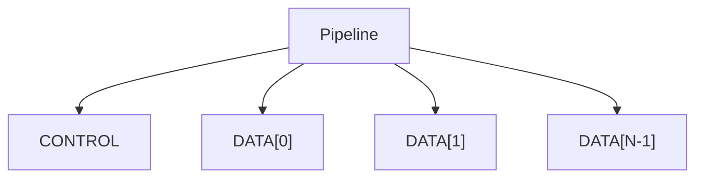
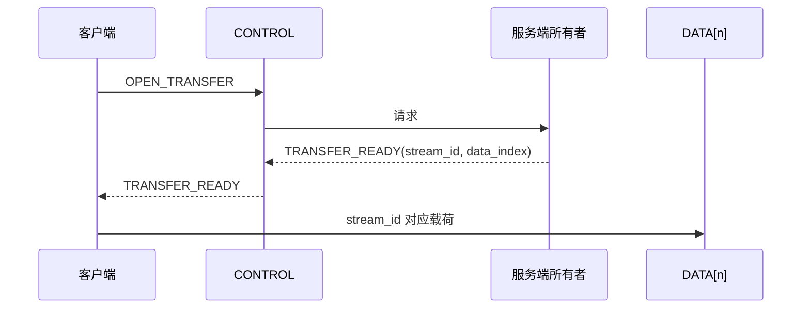

# 连接组 / Pipeline 与备份业务映射

**状态：当前核心基础能力 + 业务参考；DataShard 属于未来扩展**

> 核心边界：本文前半部分的 Pipeline、CONTROL、DATA、路由和亲和关系属于通用传输连接组；
> `backup_id`、检查点、提交、持久化确认等内容只用于说明上层备份业务如何映射到这些能力，
> 不属于 c-trpc 核心契约。

## 0. 当前基础能力

阶段 5 已经落地内部 `tr_pipeline` 易失状态、TRR1 路由、分片本地注册表、
已接收 DATA 入口、内部 CONTROL 会话、`TRC1` CONTROL 线协议，以及真实的
分片本地 Pipeline 监听器/CONTROL 传输处理器。阶段 6 P3 第一阶段进一步加入
服务端公开连接组门面：应用通过 `tr/transport.h` 配置组容量、CONTROL 授权、
DATA 接收回调，并由 `tr_server` 拥有监听器生命周期；公开契约不暴露 Reactor、
注册表、TRR1 解析器、连接槽位或成员代次。

当前对象关系固定为：

```text
一个 Pipeline
  -> 一个 Reactor 所有者
  -> 可选 CONTROL 成员关系
  -> 有界 DATA[0..N-1] 成员关系
  -> 有界 Stream -> DATA 亲和关系表
```

已经编码的不变量：

- CONTROL/DATA 连接必须属于 Pipeline 所有者 Reactor；
- 同一个物理连接只能出现一次，不能同时属于 CONTROL 与 DATA；
- DATA 槽位使用独立代次，槽位复用不会造成 ABA；
- DATA 选择采用所有者串行化的轮询，只用于建立新 Stream；
- Stream 一旦绑定 DATA，在其生命周期内不允许重新绑定；
- 亲和关系保存 `(data_index, data_generation)`；
- DATA 移除会使绑定该代次的所有 Stream 亲和关系立即失效；
- 同一索引后续被新连接复用时，旧 Stream 不会“复活”到新连接；
- 成员关系/亲和关系都是有界预分配状态，不存在无界容器。

所有可变操作都通过 Pipeline 所有者 Reactor 串行化。

当前路由前导信息、注册表、DATA 预留/附着、已接收入口都已经实现；
内部 CONTROL 会话也已经可以签发 DATA 提供信息，并通过原子建立 Stream 亲和关系形成
`TRANSFER_READY` 屏障。固定 48 字节的 `TRC1` CONTROL 载荷已经实现
`DATA_OFFER / DATA_CANCEL / TRANSFER_READY` 编解码，并直接绑定对应内部状态转换。

当前公开能力状态：

- 服务端：已经提供独立连接组监听器、CONTROL 授权、DATA 接收/事件回调、
  `DATA_OFFER`、`TRANSFER_READY` 与传输释放；
- DATA 回调只看到 `group_id/epoch + stream_id/message_id + bytes`；
  保留 RX 缓冲区通过不透明释放能力保持载荷零额外复制；
- 监听器/运行时所有权仍为单所有者；V1 门面当前绑定一个内部所有者域，
  但这个选择不是公开标识的一部分；
- 客户端 CONTROL 连接/关闭已经进入稳定门面；TRR1 CONTROL 路由、
  所有者分片和成员代次全部由内部生成；
- 客户端可以通过语义配置 `max_data_connections` 启用有界自动 DATA 通道；
  `DATA_OFFER` 的精确路由由内部引擎消费，并在同一所有者域内完成
  非阻塞连接、前导信息发送和接管；
- DATA 建立不会新增连接线程：连接就绪复用 Reactor 辅助 fd 事件，
  超时复用 Reactor 定时器；同一时刻最多一个连接尝试处于进行中；
- `DATA_CANCEL` 按精确代次幂等收敛：只释放 `RESERVED`；
  `ATTACHED` 或同代次 `FREE` 为无操作，代次复用后才返回 `STALE`；
  因此完整前导信息发出后的附着模糊窗口不需要新增 `DATA_ATTACH_ACK`；
- `max_data_connections == 0` 仍保持仅 CONTROL，并通过精确 `DATA_CANCEL`
  归还提供信息对应的预留；
- 客户端已经消费 `TRANSFER_READY`：READY 中的 DATA 索引/代次必须精确命中
  当前 `ACTIVE` 通道，成功后在所有者内建立有界
  `stream_id -> 精确 DATA 代次` 亲和关系；公开回调仍只暴露语义上的组/Stream/消息标识；
- 客户端释放操作删除本地亲和关系；DATA 通道移除只失效指向该精确代次的亲和关系，
  同一索引后续复用不会使旧 Stream 复活；
- 客户端逻辑 DATA 发送已经进入稳定门面：每次发送都会重新验证 Stream 亲和关系
  对应的 `ACTIVE` DATA 代次；公开载荷只在调用期间借用，并在返回 `TR_OK` 前复制到
  内部拥有的缓冲区；
- 组发送内存使用 `max_data_connections * max_message_bytes` 作为所有者本地
  有界额度；TX 完成、连接关闭或提交失败都会通过一次性 Buffer 释放钩子归还额度；
  Reactor 继续负责 DATA 分片和 TX 调度；
- 发送准入当前以 `TR_AGAIN + 调用方重试` 表达；暂不暴露可写回调，
  避免把组额度与 Reactor 全局 TX 资源池两类资源错误压缩成一个虚假就绪事件；
- 客户端/服务端已经提供稳定优雅排空：服务端排空只停止新的组连接接收并禁止
  新 `DATA_OFFER/TRANSFER_READY`，已有组/传输继续完成；客户端排空停止新的
  DATA 建立，已有 READY 传输继续发送/释放；
- `wait_drained` 只等待语义工作静默：客户端等待活动传输/发送所有权归零，
  服务端等待现有组/连接自然归零；强制 `stop()` 仍保留立即关闭语义；
- 稳定组统计只暴露活动组/连接/DATA/传输、接收/拒绝以及客户端发送字节生命周期，
  不暴露 Reactor 槽位/代次、队列/资源池/连接器；
- 服务端 DATA 入口不信任对端仅凭已经附着的物理通道自报 `stream_id`：
  每个 DATA 帧在进入回调前，都通过 Pipeline 亲和关系验证
  `stream_id + DATA 索引/代次 + 连接` 是否精确匹配；
  未 READY、陈旧或错误通道的帧会直接终止违规 DATA 通道；
- 跨分片 fd 转移仍只在性能分析或部署需求证明必要时考虑。

因此当前 `tr_pipeline` 是传输层内部的所有权/成员关系基础设施，
不是业务协议对象。备份持久化标识、检查点、提交和续传都由上层业务定义。

## 0.1 路由前导信息

新物理连接在进入普通 `TRP1` 传输分帧之前，先发送固定 48 字节
Pipeline 路由前导信息：

```text
offset  size  field
0       4     magic = "TRR1"
4       2     route_version
6       2     role = CONTROL | DATA
8       4     flags
12      4     owner_shard_id
16      8     pipeline_id
24      8     epoch
32      4     member_index
36      4     member_generation
40      4     header_crc32c
44      4     reserved
```

全部整数使用小端编码，与现有传输线协议编码一致；CRC 使用 CRC32C。

语义：

```text
CONTROL:
    member_index = UINT32_MAX
    member_generation != 0

DATA:
    member_index = 已预留的 DATA 索引
    member_generation = CONTROL 控制面签发的成员代次
```

`member_generation` 是 Pipeline 成员能力代次，不是 Reactor 连接槽位代次。
协议层禁止把 Reactor 槽位/代次暴露为远端路由标识。

`owner_shard_id` 同样是 CONTROL 控制面签发的路由目标，不是客户端可以自证的值。
未来附着时必须同时验证：

```text
pipeline_id
epoch
owner_shard_id
role
member_index
member_generation
```

只有与服务端 Pipeline 注册表/预留状态完全匹配后，连接才能加入组。

当前解析器支持任意 TCP 分片与合并：

```text
recv:
    [部分前导信息]
    [剩余前导信息 + TRP1 HELLO 字节]
```

解析器只消费 48 字节前导信息；同一次读取中剩余的传输字节原样留给普通帧解析器。
完整前导信息一旦 CRC 或语义校验失败，就直接视为连接致命错误，不尝试从任意字节重新同步。

当前已经增加分片本地有界 Pipeline 注册表、DATA 预留/附着能力，
以及所有者本地已接收 DATA 前导信息门控/入口路径。

### 注册表 / 预留

每个所有者分片可以维护一个有界 Pipeline 注册表：

```text
注册表（分片 S）
  -> pipeline_id -> Pipeline*
```

注册表修改、路由附着与 Pipeline 修改一样，都通过该分片 Reactor 所有者串行化；
没有服务端全局注册表互斥锁。注册表不拥有 Pipeline 生命周期。

只有成员关系已经静默时才允许注销 Pipeline：

```text
CONTROL 未绑定
已预留 DATA = 0
已附着 DATA = 0
Stream 亲和关系 = 0
```

因此关闭顺序必须先停止并清理成员，再从注册表注销，最后销毁 Pipeline；
不能先从注册表移除一个仍有已路由套接字的 Pipeline。
注册表 API 不把裸 `Pipeline*` 返回到所有者域之外；
后续按标识执行的 CONTROL 控制面操作应在注册表所有者内部完成“查找 + 操作”，
而不是让指针逃逸出所有者调用生命周期。

`pipeline_id` 在一个分片注册表内是唯一键。旧 `epoch` 仍注册时，
新 `epoch` 不能以同一 `pipeline_id` 并存：

```text
register pipeline_id=P epoch=9  -> OK
register pipeline_id=P epoch=10 -> reject
unregister epoch=9
register epoch=10               -> OK
```

这样可以保证 `epoch` 隔离不会退化成“同一个标识的多个版本都能被路由”。

DATA 成员关系已经从一次性添加拆成：

```text
FREE
  -> reserve
RESERVED(index,generation)
  -> attach exact capability
ATTACHED(connection)
  -> remove
FREE
```

预留会占用 DATA 容量，但不会参与轮询选择、Stream 亲和关系或载荷路由。
取消只接受完全匹配的 `RESERVED` 代次。

DATA 能力只能由活动 CONTROL 生命周期签发和消费：
没有 CONTROL 时，预留/附着都会返回状态错误；
清除 CONTROL 会立即取消所有仍为 `RESERVED` 的能力。
已经 `ATTACHED` 的 DATA 连接不会在 `clear_control()` 中被隐式销毁，
而由上层 Pipeline 销毁流程明确处理。

DATA 路由附着顺序：

```text
已经校验的 TRR1 字段
  -> owner_shard == 注册表所属分片
  -> 查找 pipeline_id
  -> epoch 与已注册 Pipeline 匹配
  -> 连接属于注册表 Reactor
  -> (member_index, member_generation) 匹配 RESERVED 槽位
  -> 附着 DATA 连接
```

错误分片、`epoch`、代次、角色或所有者 Reactor 都不能消耗预留。
只有精确能力附着成功后，`RESERVED` 才转换为 `ATTACHED`。

前导信息的原始魔数/CRC 由路由解析器负责；
注册表附着阶段再次验证字段语义与服务端注册表/预留状态。
两者职责不混用。

当前已经增加内部已接收 DATA 入口路径：

```text
监听/接收
  -> Reactor 通过固定长度前导信息门控接管
  -> 精确读取 48 字节 TRR1
  -> 解析 + CRC/字段校验
  -> 注册表按代次精确匹配预留后附着
  -> 安装已路由下游帧/事件处理器
  -> 现有 TRP1 解析器
```

Reactor 前导信息门控按需启用；
普通 RPC 连接继续直接进入 TRP1 解析器，不增加额外原始缓冲区复制或路由分支。

门控每次 `recv()` 最多只读取尚未完成的前导信息字节，因此即使套接字接收队列中已经是：

```text
[剩余 TRR1][TRP1 HELLO/PING 字节]
```

Reactor 也不会过读。TRR1 完成并成功附着后，
下一次所有者 RX 循环才把剩余字节交给已有 TRP1 解析器。

错误路由标识会直接使该已接收连接失败，但不会消耗 DATA 预留；
客户端可以使用原精确能力重新连接。

成功 DATA 连接的事件处理器负责生命周期闭环：

```text
CLOSED / ERROR
  -> 注册表精确解除附着（connection + route capability）
  -> tr_pipeline_remove_data()
  -> 失效绑定的 Stream 亲和关系
  -> 下游连接事件
```

精确连接匹配可以防止旧连接的延迟关闭回调删除同一槽位代次后续的新 DATA 成员关系。

当前这个入口适配器仍是内部基础能力；
它不会替换现有公开服务端 RPC 监听器，CONTROL 连接创建/注册也通过连接组控制面独立管理。

## 0.2 CONTROL 会话 / TRANSFER_READY

阶段 5 已经增加内部 `tr_pipeline_control` 会话，
作为一个运行期 Pipeline 的生命周期所有者。
注册表仍然只是分片本地索引，不接管 Pipeline 内存。

CONTROL 会话创建顺序固定为：

```text
创建 Pipeline(owner shard, pipeline_id, epoch)
  -> 绑定 CONTROL 连接
  -> 在分片注册表注册 Pipeline
```

创建成功后，CONTROL 可以签发 DATA 能力：

```text
reserve_data()
  -> Pipeline RESERVED(index, generation)
  -> DATA 提供信息
       pipeline_id
       epoch
       owner_shard_id
       member_index
       member_generation
```

该提供信息可以直接编码成前述 TRR1 DATA 前导信息。
签发提供信息本身**不等于** DATA 已经就绪：
只要套接字还没有通过入口精确附着，Pipeline 中仍只有 `RESERVED`。

`TRANSFER_READY` 的内部屏障原语为：

```text
prepare_transfer(stream_id)
  -> 要求 CONTROL 活动
  -> 要求至少一个 ATTACHED DATA
  -> 跳过全部 RESERVED 槽位
  -> 由所有者轮询选择 ATTACHED DATA
  -> 原子绑定 Stream -> (data_index, generation)
  -> 返回 TRANSFER_READY 令牌
```

因此只有 `prepare_transfer()` 返回 `TR_OK` 后，
CONTROL 才允许向客户端宣告该 Stream 可以在指定 DATA 成员关系上发送载荷。
预留尚未附着时返回 `TR_AGAIN`，不会错误提前发送 READY。

Stream 亲和关系建立和 DATA 选择在同一个 Reactor 所有者操作内完成，
不存在“先选择 DATA，期间连接被移除，再绑定 Stream”的窗口。

CONTROL 会话关闭也有明确的静默门禁：

```text
attached DATA != 0      -> 拒绝关闭
Stream affinity != 0    -> 拒绝关闭
只剩 RESERVED           -> 清除 CONTROL 并取消预留
                        -> 从注册表注销
                        -> 销毁 Pipeline
```

这保证注册表不会留下指向已经释放 Pipeline 的条目，
也不会在活动 DATA/Stream 仍依赖 Pipeline 时提前注销。

## 0.3 CONTROL 线协议

CONTROL 运行时状态已经具有固定 48 字节 `TRC1` 线协议载荷：

```text
offset  size  field
0       4     magic = "TRC1"
4       2     control_version = 1
6       2     type
8       4     flags = 0
12      4     owner_shard_id
16      8     pipeline_id
24      8     epoch
32      4     stream_id
36      4     data_index
40      4     data_generation
44      4     reserved = 0
```

当前定义三种消息：

```text
DATA_OFFER
  stream_id = 0
  精确 (owner_shard, pipeline_id, epoch, data_index, generation)

DATA_CANCEL
  stream_id = 0
  精确预留标识

TRANSFER_READY
  stream_id != 0
  精确 ATTACHED DATA 标识
```

`TRC1` 不携带 Reactor 槽位/代次。
`DATA_OFFER` 可以通过唯一编解码辅助接口直接转换为 TRR1 DATA 路由能力，
避免门面重新拼接标识。

状态与线协议的绑定不是“先改状态，再由另一个模块猜字段”：

```text
reserve_data_wire()
  -> 预留 DATA 能力
  -> 编码 DATA_OFFER
  -> 编码失败 => 取消精确预留

cancel_data_wire()
  -> 解码/校验 DATA_CANCEL
  -> 重建精确能力标识
  -> 只取消匹配的 RESERVED 槽位

prepare_transfer_wire(stream_id)
  -> 原子执行 prepare_transfer()
  -> 要求 ATTACHED DATA
  -> 绑定 Stream 亲和关系
  -> 编码 TRANSFER_READY
  -> 编码失败 => 释放新建立的亲和关系
```

因此 DATA 仍处于 `RESERVED` 时，
`prepare_transfer_wire()` 返回 `TR_AGAIN` 且不会生成任何 READY 载荷；
只有精确入口附着成功后才能形成 `TRANSFER_READY`。

`TRC1` 已经安装到真实传输 CONTROL 路径。
Pipeline 监听器在每个所有者分片内拥有有界注册表、连接/会话槽位
与 48 字节 CONTROL 消息资源池。

真实已接收套接字路径：

```text
accept
  -> 精确 48 字节 TRR1 门控
  -> CONTROL：强制授权钩子
       -> 创建/绑定/注册 Pipeline
       -> 安装 TR_FRAME_PIPELINE_CONTROL 处理器
  -> DATA：注册表按代次精确匹配预留后附着
       -> 安装普通 TRP1 DATA 下游处理器
```

CONTROL 载荷使用独立的 `TR_FRAME_PIPELINE_CONTROL` 传输帧类型，
因此不会占用 BULK DATA TX 项资源池。
当前服务端控制面可以在所有者上发出
`DATA_OFFER / TRANSFER_READY`；
客户端 `DATA_CANCEL` 由真实帧回调解码，并且只消费精确 `RESERVED` 能力。

CONTROL 标识**不是客户端自证授权**。
监听器要求调用方提供授权钩子；
钩子在 Pipeline 创建/注册之前校验完整 TRR1 CONTROL 路由，
包括 `owner_shard/pipeline_id/epoch/member_generation`。

CONTROL 连接异常关闭时执行组级致命易失状态销毁：

```text
把会话标记为 CLOSING
  -> 获取 ATTACHED DATA 快照
  -> 失效 DATA 成员关系 + Stream 亲和关系
  -> 清除 CONTROL + 取消 RESERVED 能力
  -> 注销/销毁 Pipeline
  -> 由所有者立即关闭 DATA 套接字
  -> 释放监听器会话/连接槽位
```

这保证 DATA 事件回调即使在销毁过程中重入，
也看不到仍可接收新 OFFER/READY 的旧会话；
旧注册表标识也不会在新 `epoch` 注册后复活。

底层监听器仍是内部分片组件，不直接作为公开 `tr_server` / `tr_client`
对象暴露；公开门面只暴露语义连接组能力。
备份持久化语义仍属于上层业务。

---

## 业务映射参考（非核心）

以下章节保留“备份”作为使用连接组的示例。
它们不定义 c-trpc 核心 API，也不进入 c-trpc 核心演进路线。

## 1. 定义

备份任务是持久业务对象；Pipeline 是一次运行期的传输/协议易失状态域。

```text
备份任务
    !=
Pipeline
    !=
TCP 连接
```

V1 目标：

```text
一个 Pipeline
    =
一个 Reactor 所有者
    =
一个 CONTROL
    +
N 个 DATA 连接
```

## 2. 连接组


```mermaid
flowchart TB
    P["Pipeline"]
    C["CONTROL"]
    D0["DATA[0]"]
    D1["DATA[1]"]
    DN["DATA[N-1]"]

    P --> C
    P --> D0
    P --> D1
    P --> DN
```

CONTROL 负责：

- 打开/续传；
- 建立传输；
- `CANCEL`；
- `BARRIER`；
- `CREDIT`；
- 批量确认；
- `COMMIT/ABORT`；
- 保活/错误。

DATA 只承担大块载荷。

## 3. 标识

需要区分：

```text
backup_id
    持久业务标识

pipeline_id
    运行时实例标识

epoch
    持久化隔离代次
```

工作线程或服务端重启后 Pipeline 可以重建，但 `backup_id` 不变。

## 4. Stream 与 DATA 亲和关系

一个 Stream 生命周期内只绑定一个 DATA 连接：

```text
Stream 1001 -> DATA[2]
```

禁止同一个 Stream 的帧在 DATA[0]/DATA[1]/DATA[2] 之间跳转。

DATA[2] 失败时，旧 Stream 终止，通过新 Stream 重试。

## 5. 条带化

允许：

```text
数据块 0 -> DATA[0]
数据块 1 -> DATA[1]
数据块 2 -> DATA[2]
数据块 3 -> DATA[0]
```

禁止：

```text
数据块 A 分片 0 -> DATA[0]
数据块 A 分片 1 -> DATA[1]
```

因为多个 TCP 连接之间不存在统一字节顺序。

## 6. 跨套接字顺序

CONTROL 与 DATA 之间必须显式建立屏障：


```mermaid
sequenceDiagram
    participant C as 客户端
    participant CTL as CONTROL
    participant S as 服务端所有者
    participant D as DATA[n]

    C->>CTL: OPEN_TRANSFER
    CTL->>S: 请求
    S-->>CTL: TRANSFER_READY(stream_id, data_index)
    CTL-->>C: TRANSFER_READY
    C->>D: stream_id 对应载荷
```

客户端只有收到 `TRANSFER_READY` 后，才能在指定 DATA 连接发送数据。

## 7. 易失状态

Pipeline 内允许保存：

- 进行中数据块表；
- 最近完成缓存；
- 批量确认；
- 去重/哈希缓存；
- 重排序元数据；
- 压缩/加密上下文；
- 存储句柄；
- 缓冲区记账；
- 流量控制；
- 运行时指标。

这些状态允许整个服务端崩溃后丢失。

## 8. 持久化事实

以下信息不能只存在于 Pipeline 内存：

- 数据块持久化完成状态；
- 清单；
- 权威续传检查点；
- 备份提交状态；
- 快照可见性；
- `epoch`；
- 保留策略/WORM。

所以服务端模型是：

```text
为了性能可以持有运行时状态
为了正确性不能依赖运行时状态
```

更准确地说：

```text
易失状态丰富 + 持久正确性不依赖进程内状态
```

## 9. 流量控制

Pipeline 不只依赖 TCP 窗口：

```text
Stream 额度
  -> 连接预算
  -> Pipeline 进行中工作预算
  -> 分片内存预算
  -> 工作线程准入
  -> 存储后端容量
```

服务端声明的额度应由真实资源能力驱动。

## 10. 超大 Pipeline

V1 保持一个 Pipeline 对应一个 Reactor，以获得最简单的所有权模型。

未来如果基准测试证明：

```text
一个 Pipeline 已经耗尽一个 Reactor
同时其他 Reactor 分片仍处于空闲状态
```

再拆分为：

```text
备份任务
    |
控制所有者
    |
    +-- DataShard 0 -> R0
    +-- DataShard 1 -> R3
    +-- DataShard 2 -> R6
```

DataShard 之间仍然不共享可变 Pipeline 对象，
只交换消息/完成事件。
