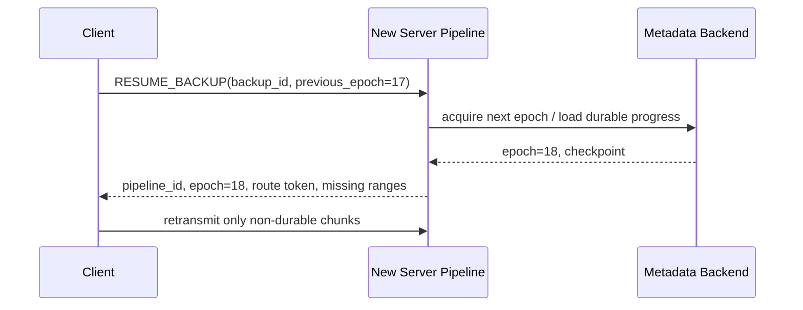

# Durability 与 Recovery

**状态：TARGET V1**

## 1. ACK Level

不要用一个模糊的 `OK` 同时表示收到、落盘和最终提交。

至少区分：

```text
STORED
CHECKPOINTED
COMMITTED
```

### STORED

数据已经跨过协议约定的 durable boundary，例如：

- local storage fsync；
- object PUT committed；
- replica quorum；
- HA staging pool committed。

“只进入 Server RAM”不能算 STORED。

### CHECKPOINTED

Server restart 后可以从 durable metadata 恢复该进度。

### COMMITTED

最终 manifest/snapshot 已原子发布，Backup 正式可见。

## 2. ACK Batch

推荐通过 CONTROL 聚合：

```text
ACK_BATCH
  chunk 100 STORED
  chunk 101 STORED
  chunk 102 STORED
```

避免每个 DATA chunk 产生一个小型 control packet/wakeup。

## 3. Epoch Fencing

每个 Backup 的 durable metadata 维护当前 epoch：

```text
backup B
current_epoch = 17
```

发生恢复/takeover：

```text
17 -> 18
```

任何 durable mutation 都必须携带 epoch。

如果：

```text
request/completion epoch != current_epoch
```

必须拒绝为 STALE。

这防止旧 Pipeline、旧 worker task 或延迟 completion 在新实例接管后污染状态。

## 4. Resume



Client 与 Server durable state 做 reconciliation。

## 5. Commit

```text
Client
  -> BARRIER
Server
  -> stop/limit new admission
  -> wait admitted tasks reach required state
  -> checkpoint
  -> BARRIER_OK

Client
  -> COMMIT(backup_id, epoch, manifest_hash, request_id)

Metadata
  -> verify current epoch
  -> idempotent compare
  -> atomic publish
  -> COMMITTED
```

重复相同 Commit 应返回成功/Already Committed。

相同 backup/epoch 但不同 manifest 必须返回 conflict。

## 6. Failure Rules

### DATA connection down

其他 DATA 可以继续。

属于断开 connection 的未 durable-ACK 数据重新发送。

### CONTROL down

V1：

```text
suspend Pipeline
 -> close DATA group
 -> reconnect
 -> RESUME
```

不做 CONTROL 热切换。

### Server process crash

所有 soft state 全部丢失。

Client 重新连接任意 Server instance，通过 durable metadata + epoch 重建。

## 7. 必须测试的 Crash Window

- data durable 前 crash；
- data durable 后、ACK 前 crash；
- ACK 后、checkpoint 前 crash；
- checkpoint 中 crash；
- commit 中 crash；
- old completion 在 new epoch 创建后到达。

最终要求：

```text
no silent data loss
no stale mutation
no duplicate final commit
resume deterministic
```
