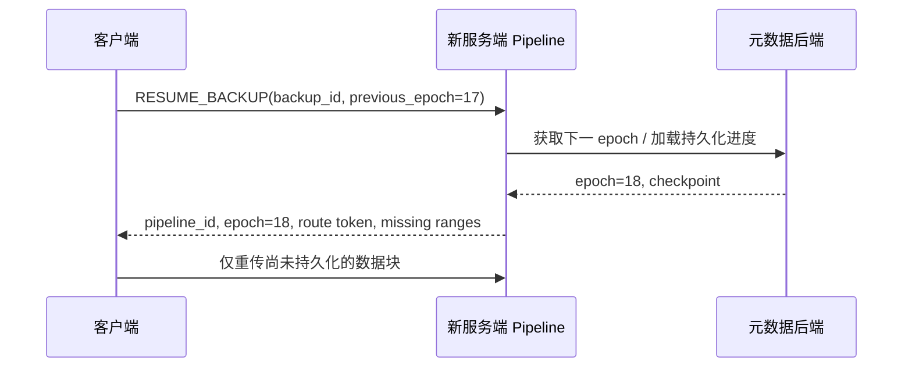

# 备份持久性与恢复（业务参考）

**状态：业务参考/非核心**

> 本文描述备份业务如何在 c-trpc RPC/连接组之上实现持久性、代次隔离、续传与提交。它不属于 c-trpc 核心契约，不要求运行时、传输或 RPC 层实现 `backup_id`、检查点、清单、`COMMITTED` 等业务状态。

## 1. 确认级别

不要用一个模糊的 `OK` 同时表示收到、落盘和最终提交。

至少区分：

```text
STORED
CHECKPOINTED
COMMITTED
```

### STORED

数据已经跨过协议约定的持久化边界，例如：

- 本地存储完成 `fsync`；
- 对象 `PUT` 已提交；
- 副本达到多数确认；
- 高可用暂存池已提交。

“只进入服务端内存”不能算 `STORED`。

### CHECKPOINTED

服务端重启后可以从持久化元数据恢复该进度。

### COMMITTED

最终清单/快照已经原子发布，备份正式可见。

## 2. 批量确认

推荐通过 CONTROL 聚合：

```text
ACK_BATCH
  数据块 100 STORED
  数据块 101 STORED
  数据块 102 STORED
```

避免每个 DATA 数据块都产生一个小型控制包和一次唤醒。

## 3. 代次隔离

每个备份任务的持久化元数据维护当前 `epoch`：

```text
备份 B
current_epoch = 17
```

发生恢复或接管：

```text
17 -> 18
```

任何持久状态修改都必须携带 `epoch`。

如果：

```text
请求/完成事件的 epoch != current_epoch
```

必须拒绝为 `STALE`。

这可以防止旧 Pipeline、旧工作任务或延迟到达的完成事件在新实例接管后污染状态。

## 4. 续传


```mermaid
sequenceDiagram
    participant C as 客户端
    participant S as 新服务端 Pipeline
    participant M as 元数据后端

    C->>S: RESUME_BACKUP(backup_id, previous_epoch=17)
    S->>M: 获取下一 epoch / 加载持久化进度
    M-->>S: epoch=18, checkpoint
    S-->>C: pipeline_id, epoch=18, route token, missing ranges
    C->>S: 仅重传尚未持久化的数据块
```

客户端与服务端的持久状态需要进行对账，以确定真正缺失的数据范围。

## 5. 提交

```text
客户端
  -> BARRIER
服务端
  -> 停止或限制新的准入
  -> 等待已准入任务达到要求状态
  -> 写入检查点
  -> BARRIER_OK

客户端
  -> COMMIT(backup_id, epoch, manifest_hash, request_id)

元数据
  -> 校验当前 epoch
  -> 执行幂等比较
  -> 原子发布
  -> COMMITTED
```

重复提交完全相同的请求应返回成功或“已经提交”。

相同备份/`epoch` 但不同清单必须返回冲突。

## 6. 故障规则

### DATA 连接断开

其他 DATA 连接可以继续工作。

属于断开连接且尚未收到持久化确认的数据需要重新发送。

### CONTROL 连接断开

V1：

```text
挂起 Pipeline
 -> 关闭 DATA 连接组
 -> 重新连接
 -> RESUME
```

不做 CONTROL 热切换。

### 服务端进程崩溃

所有易失状态全部丢失。

客户端重新连接任意服务端实例，通过持久化元数据 + `epoch` 重建状态。

## 7. 必须测试的崩溃窗口

- 数据持久化前崩溃；
- 数据持久化后、确认前崩溃；
- 确认后、检查点前崩溃；
- 写检查点过程中崩溃；
- 提交过程中崩溃；
- 新 `epoch` 创建后旧完成事件才到达。

最终要求：

```text
不允许静默丢失数据
不允许旧代次修改新状态
不允许重复完成最终提交
续传结果必须确定
```
